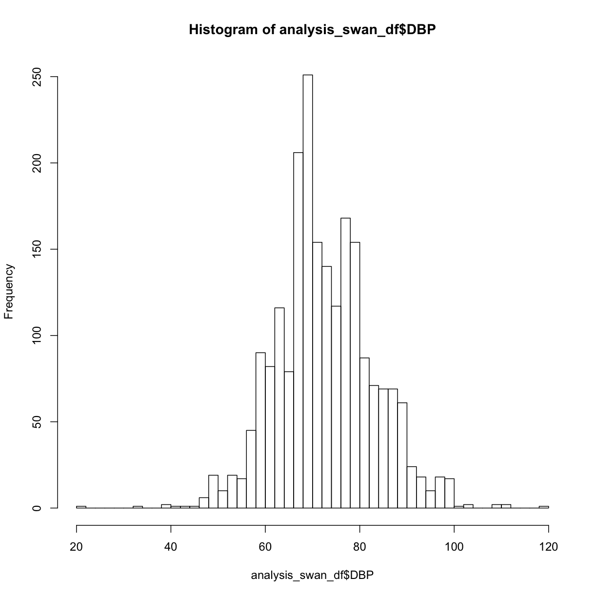
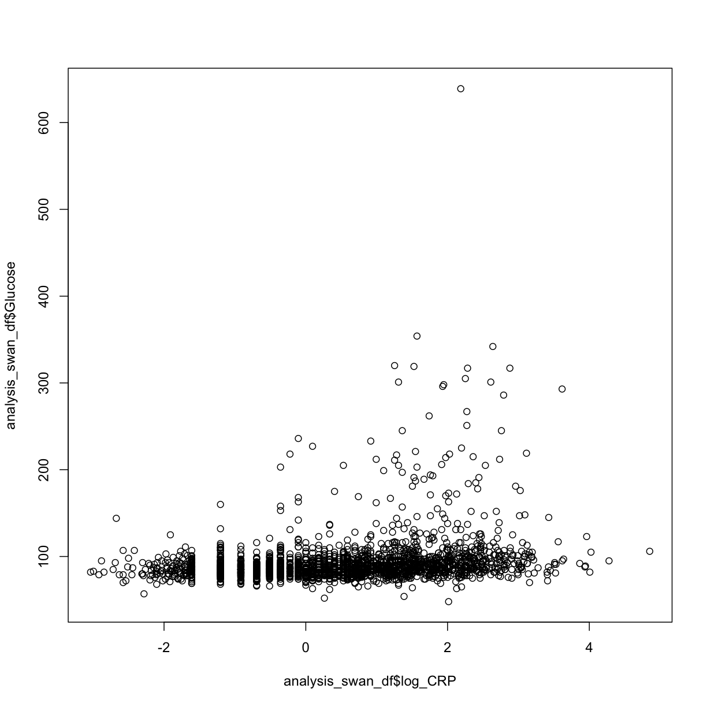

---
# Please do not edit this file directly; it is auto generated.
# Instead, please edit 07-exploring-continuous-data.md in _episodes_rmd/
title: "Exploring Continuous Data"
teaching: 45
exercises: 10
questions:
- "How can I calculate basic statistics of a variable?"
- "How can I see the distribution of a variable?"
objectives:
- "Learn how to view mean, quartiles, standard deviation"
- "Techniques for dealing with null values in R -- ex. null might be represented in the data as `999`"
- "Learn how to create new variables as transformations of other variables"
keypoints:
- "Use `hist()` to view a histogram"
- "Use `boxplot()`"
- "Use `plot()` to create an X-Y scatterplot"
source: Rmd
---


# Continuous Variables and Linear Regression

#TODO:  Better wording

To perform an analysis that assesses whether one or more predictor variables might explain a response or outcome variable, we need to check whether the data meets certain assumptions if we'd like to use linear regression to prove our hypothesis about the relationship between the predictors and the outcome.

The assumptions that the data must meet in order to build a valid linear regression model are:
1. A linear relationship between each continuous predictor (X), and the outcome variable (Y)
2. Each continuous predictor has a normal distribution
3. No collinearity between predictors
4. No auto-correlation (residuals are not related to each other)
5. Homoscedasticity (no pattern in the residuals)

In this episode, we'll be using R to investigate these assumptions.

# Checking normality

## Getting to know our data

One of the first ways to start getting to know our data is to get some basic statistics.  Let's see what the `summary()` function does:


~~~
summary(analysis_swan_df)
~~~
{: .language-r}


~~~
       X              SWANID           Age             RACE      
 Min.   :   1.0   Min.   :10046   Min.   :47.00   Min.   :1.000  
 1st Qu.: 606.8   1st Qu.:31312   1st Qu.:50.00   1st Qu.:1.000  
 Median :1212.5   Median :53827   Median :52.00   Median :4.000  
 Mean   :1212.5   Mean   :53753   Mean   :51.97   Mean   :2.847  
 3rd Qu.:1818.2   3rd Qu.:76142   3rd Qu.:54.00   3rd Qu.:4.000  
 Max.   :2424.0   Max.   :98792   Max.   :59.00   Max.   :5.000  
                                  NA's   :1                      
      BMI           Glucose           Smoker            LDL       
 Min.   :16.29   Min.   : 48.00   Min.   :-9.000   Min.   : 30.0  
 1st Qu.:23.32   1st Qu.: 82.00   1st Qu.: 1.000   1st Qu.: 98.0  
 Median :27.25   Median : 88.00   Median : 1.000   Median :119.0  
 Mean   :28.89   Mean   : 94.26   Mean   : 1.127   Mean   :121.1  
 3rd Qu.:32.92   3rd Qu.: 96.00   3rd Qu.: 1.000   3rd Qu.:142.0  
 Max.   :64.86   Max.   :639.00   Max.   : 2.000   Max.   :303.0  
 NA's   :305     NA's   :433      NA's   :116      NA's   :460    
      HDL             CRP               DBP              SBP       
 Min.   : 16.0   Min.   :  0.048   Min.   : 20.00   Min.   : 74.0  
 1st Qu.: 47.0   1st Qu.:  0.700   1st Qu.: 68.00   1st Qu.:106.0  
 Median : 57.0   Median :  1.800   Median : 72.00   Median :116.0  
 Mean   : 58.2   Mean   :  4.070   Mean   : 73.58   Mean   :118.2  
 3rd Qu.: 68.0   3rd Qu.:  4.700   3rd Qu.: 80.00   3rd Qu.:128.0  
 Max.   :119.0   Max.   :128.000   Max.   :120.00   Max.   :220.0  
 NA's   :367     NA's   :363       NA's   :292      NA's   :292    
    Exercise     
 Min.   :-7.000  
 1st Qu.: 1.000  
 Median : 2.000  
 Mean   : 1.681  
 3rd Qu.: 2.000  
 Max.   : 2.000  
 NA's   :274     
~~~
{: .output}

We see that in addition to calculating mean, median, minimum, maximum, and the 1st and 3rd quartiles for each variable, `summary()` also includes a tally of the number of `NA`s in each variable.

Not only does this give us a quick sense for the range of values for each variable, it can also give us a clue as to problems in the data.


> ## Exercise
> 
> What potential problems might there be with a data frame where `summary()` results in the following:
> > 
> > ~~~
> > summary(height_df)
> > ~~~
> > {: .language-r}
> > 
> > 
> > 
> > ~~~
> >      month            day          height_cm    
> >  Min.   : 1.00   Min.   : 0.00   Min.   :-2.00  
> >  1st Qu.: 2.75   1st Qu.: 1.25   1st Qu.:55.00  
> >  Median : 9.00   Median : 5.00   Median :60.00  
> >  Mean   : 8.00   Mean   : 8.00   Mean   :49.67  
> >  3rd Qu.:10.75   3rd Qu.:11.25   3rd Qu.:69.00  
> >  Max.   :19.00   Max.   :31.00   Max.   :73.00  
> >                                  NA's   :1      
> > ~~~
> > {: .output}
> 
> 
> > ## Solution
> >
> > * There might be problems in `month` because the maximum is 19.
> > * There might be problems in `day` because the minimum is 0.
> > * There might be issues with `height_cm` beacuse the minimum is a negative value.
> >
> {: .solution}
{: .challenge}

## Computing individual statistics

#TODO: Use of mean(), stdev() etc.


## Visualizations of single variables

Even though some of our variables aren't really continuous (we'll deal with those soon), we can start looking at the continuous variables.

Visualizations of single variables might include histograms, boxplots, or other types of plots.

Let's take a look at the DBP (diastolic blood pressure) of the subjects in our data.

A basic histogram, created with `hist()` with no optional parameters, gives us a starting point:


~~~
hist(analysis_swan_df$DBP)
~~~
{: .language-r}


What are some of the parameters we can control?  We can learn more about `hist()` either by typing `?hist` at the Console, or by searching for it using the search bar in the Help pane.

The help documentation includes a "default" method that shows not only the possible parameters we might use, but also their default values if we don't override them:

```
## Default S3 method:
hist(x, breaks = "Sturges",
     freq = NULL, probability = !freq,
     include.lowest = TRUE, right = TRUE,
     density = NULL, angle = 45, col = NULL, border = NULL,
     main = paste("Histogram of" , xname),
     xlim = range(breaks), ylim = NULL,
     xlab = xname, ylab,
     axes = TRUE, plot = TRUE, labels = FALSE,
     nclass = NULL, warn.unused = TRUE, ...)
```

We can read further to learn about how to use each of the parameters.  For example, if we wanted to control the breakpoints between the bins, we can specify a value for the `breaks` parameter:

```
breaks    one of:

          * a vector giving the breakpoints between histogram cells,
          * a function to compute the vector of breakpoints,
          * a single number giving the number of cells for the histogram,
          * a character string naming an algorithm to compute the number of cells (see ‘Details’),
          * a function to compute the number of cells.
```

Let's try passing `hist()` a single number giving the number of cells or bins:


~~~
hist(analysis_swan_df$DBP, breaks = 50)
~~~
{: .language-r}


#TODO: Consider other parameters

> ## Exercise
> 
> Try adding a main title, and X and Y axis titles to the histogram above.
> 
> Try filling the bars with a color.
> 
> > ## Solution
> >
> > 
> > ~~~
> > hist(analysis_swan_df$DBP, breaks = 50, main = 'Title goes here',
> >      xlab = 'Diastolic blood pressure (mmHg)', ylab = 'Frequency',
> >      col = 'pink')
> > ~~~
> > {: .language-r}
> > 
> > 
> >
> {: .solution}
{: .challenge}


#TODO: Show horizontal


~~~
boxplot(analysis_swan_df$Glucose)
~~~
{: .language-r}


# Plotting the relationship between two continuous variables

We would now like to verify that any relationship between each X and Y is roughly linear.  We can use the `plot()` function in R to quickly create a scatterplot.


~~~
plot(y = analysis_swan_df$Glucose, x = analysis_swan_df$BMI)
~~~
{: .language-r}


In this case, we see there may be some outliers where Glucose levels are high.  Given that a glucose level of over 126 mg/dL is considered Type II Diabetic, we can take a look at the scatterplot with those data excluded.

We'll make a new data frame from a subset, then redraw the scatterplot:


~~~
library(ggplot2)
analysis_swan_df %>% filter(Glucose<126) %>% ggplot(aes(x=BMI, y=Glucose)) +
    geom_point()
~~~
{: .language-r}


~~~
Warning: Removed 44 rows containing missing values (geom_point).
~~~
{: .error}


What we're looking at here is the relationship between BMI and Glucose *for subjects with normal (non-diabetic) glucose levels*.  Although it might not be obvious to the naked eye, there is an overall upward trend and it is reasonably possible that there might be a linear relationship between BMI and Glucose in this data.  

> ## Exercise
> 
> Create the following to check linear regression assumptions between CRP and Glucose:
> * A histogram of CRP values
> 
> > ## Solution
> >
> > 
> > ~~~
> > hist(analysis_swan_df$CRP, breaks = 50)
> > ~~~
> > {: .language-r}
> > 
> > 
> >
> {: .solution}
{: .challenge}

We notice here that the distribution definitely does not look like a normal distribution.   However, we might be able to apply a transformation to the data that would result in a variable that does look more normally distributed.  Based on the shape of the distribution that we see, we decide to first try applying a log transformation.

## Variable transformations

We essentially need to make a new variable in our data frame that is calculated from the values in the `CRP` variable.

You might remember back in Episode 3, we were able to create a new vector like this:

~~~
vec1 <- c(1, 2, 3)
vec1 * 3
~~~
{: .language-r}


~~~
[1] 3 6 9
~~~
{: .output}

Applying the same concept, we'll create a new variable in our `analysis_swan_df` data frame that will be the `log()` of each value in `analysis_swan_df$CRP`.  We'll call the new variable `log_CRP`:


~~~
analysis_swan_df$log_CRP <- log(analysis_swan_df$CRP)
~~~
{: .language-r}

Now let's create a histogram of `log_CRP`:


~~~
hist(analysis_swan_df$log_CRP, breaks = 50)
~~~
{: .language-r}


As we see that `log_CRP` does appear to have more of normal distribution, we can consider using this variable in our regression instead of `CRP`.  Let's continue checking our assumptions using `log_CRP`:

Next we can try a scatterplot of log_CRP versus Glucose:

~~~
plot(y = analysis_swan_df$Glucose, x = analysis_swan_df$log_CRP)
~~~
{: .language-r}


We see again that the Glucose values in the diabetic range may be problematic, so let's re-make the swan_non_diabetic subset.  This time it will have the `log_CRP` variable as well:


~~~
analysis_swan_df %>% filter(Glucose<126) %>% ggplot(aes(x=log_CRP, y=Glucose)) +
    geom_point()
~~~
{: .language-r}


~~~
Warning: Removed 5 rows containing missing values (geom_point).
~~~
{: .error}



After removing the data with high glucose values, we see that `log_CRP` could possibly have a linear relationship with `Glucose`.

> ## Exercise
> 
> Create a new variable in `analysis_swan_df` that is the ratio of total cholesterol (HDL + LDL) divided by HDL.  Call the new variable `Chol_Ratio`
> 
> > ## Solution
> >
> > 
> > ~~~
> > analysis_swan_df$Chol_Ratio <- (analysis_swan_df$HDL + analysis_swan_df$LDL)/analysis_swan_df$HDL
> > ~~~
> > {: .language-r}
> >
> {: .solution}
{: .challenge}


~~~
plot(y = analysis_swan_df$Glucose, x = analysis_swan_df$Chol_Ratio)
~~~
{: .language-r}


~~~
library(ggplot2)
analysis_swan_df %>% filter(Glucose<126) %>% ggplot(aes(x=Chol_Ratio, y=Glucose)) +
    geom_point()
~~~
{: .language-r}


~~~
Warning: Removed 19 rows containing missing values (geom_point).
~~~
{: .error}


Again, we can see that there is a possible linear trend between the predictor `Chol_Ratio` variable and the outcome `Glucose`.

Let's create the same graphs for our last continuous variable `Age`.

~~~
hist(analysis_swan_df$Age)
~~~
{: .language-r}


This Swan dataset is unique because the study was designed to understand exposures in women during their early to mid-age. For now, we are going to consider this to be sufficiently normally distributed for our analysis. 

Next we can try a scatterplot of `Age` versus `Glucose`:

~~~
plot(y = analysis_swan_df$Glucose, x = analysis_swan_df$Age)
~~~
{: .language-r}


~~~
analysis_swan_df %>% filter(Glucose<126) %>% ggplot(aes(x=Age, y=Glucose)) +
    geom_point()
~~~
{: .language-r}


~~~
Warning: Removed 1 rows containing missing values (geom_point).
~~~
{: .error}


We may not be sure what to make of it but Age variable is often a confounder.  A lot of chronic illnesses come with age so we want to make sure we assess this variable in our multivariate analysis. 

Now, that we have looked at the normality and linearity assumputions, let's proceed to the next episode. 


#TODO (maybe): 
Looking for null values
some basic filtering - for example, filter just to women of childbearing age, check for % of NA to pregnancy question
Data cleanliness - boxplots, look for outliers

