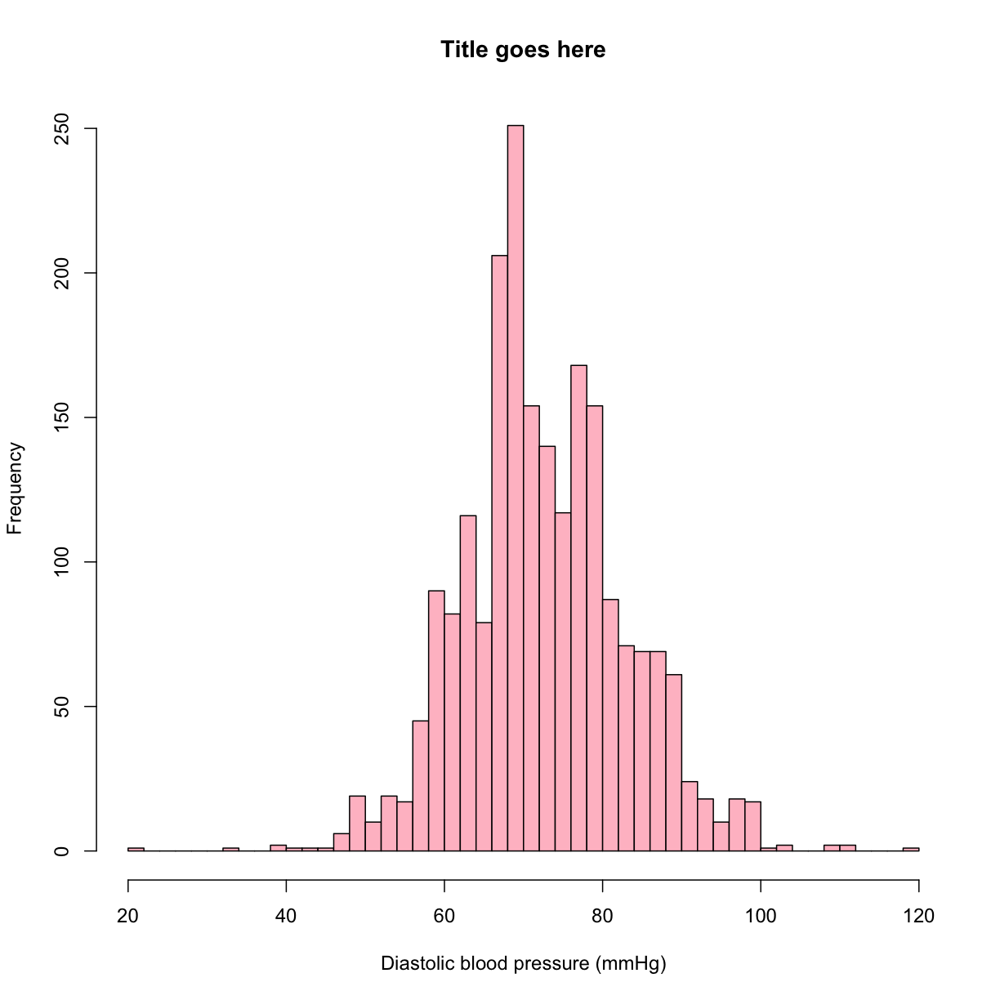

---
# Please do not edit this file directly; it is auto generated.
# Instead, please edit 07-exploring-continuous-data.md in _episodes_rmd/
title: "Exploring Continuous Data"
teaching: 45
exercises: 10
questions:
- "How can I calculate basic statistics of a variable?"
- "How can I see the distribution of a variable?"
objectives:
- "Learn how to view mean, quartiles, standard deviation"
- "Techniques for dealing with null values in R -- ex. null might be represented in the data as `999`"
keypoints:
- "Use `hist()` to view a histogram"
- "Use `boxplot()`"
source: Rmd
---


## Getting to know our data

One of the first ways to start getting to know our data is to get some basic statistics.  Let's see what the `summary()` function does:


~~~
summary(analysis_swan_df)
~~~
{: .language-r}


~~~
       X              SWANID           Age             RACE      
 Min.   :   1.0   Min.   :10046   Min.   :47.00   Min.   :1.000  
 1st Qu.: 606.8   1st Qu.:31312   1st Qu.:50.00   1st Qu.:1.000  
 Median :1212.5   Median :53827   Median :52.00   Median :4.000  
 Mean   :1212.5   Mean   :53753   Mean   :51.97   Mean   :2.847  
 3rd Qu.:1818.2   3rd Qu.:76142   3rd Qu.:54.00   3rd Qu.:4.000  
 Max.   :2424.0   Max.   :98792   Max.   :59.00   Max.   :5.000  
                                  NA's   :1                      
      BMI           Glucose           Smoker            LDL       
 Min.   :16.29   Min.   : 48.00   Min.   :-9.000   Min.   : 30.0  
 1st Qu.:23.32   1st Qu.: 82.00   1st Qu.: 1.000   1st Qu.: 98.0  
 Median :27.25   Median : 88.00   Median : 1.000   Median :119.0  
 Mean   :28.89   Mean   : 94.26   Mean   : 1.127   Mean   :121.1  
 3rd Qu.:32.92   3rd Qu.: 96.00   3rd Qu.: 1.000   3rd Qu.:142.0  
 Max.   :64.86   Max.   :639.00   Max.   : 2.000   Max.   :303.0  
 NA's   :305     NA's   :433      NA's   :116      NA's   :460    
      HDL             CRP               DBP              SBP       
 Min.   : 16.0   Min.   :  0.048   Min.   : 20.00   Min.   : 74.0  
 1st Qu.: 47.0   1st Qu.:  0.700   1st Qu.: 68.00   1st Qu.:106.0  
 Median : 57.0   Median :  1.800   Median : 72.00   Median :116.0  
 Mean   : 58.2   Mean   :  4.070   Mean   : 73.58   Mean   :118.2  
 3rd Qu.: 68.0   3rd Qu.:  4.700   3rd Qu.: 80.00   3rd Qu.:128.0  
 Max.   :119.0   Max.   :128.000   Max.   :120.00   Max.   :220.0  
 NA's   :367     NA's   :363       NA's   :292      NA's   :292    
    Exercise     
 Min.   :-7.000  
 1st Qu.: 1.000  
 Median : 2.000  
 Mean   : 1.681  
 3rd Qu.: 2.000  
 Max.   : 2.000  
 NA's   :274     
~~~
{: .output}

We see that in addition to calculating mean, median, minimum, maximum, and the 1st and 3rd quartiles for each variable, `summary()` also includes a tally of the number of `NA`s in each variable.

Not only does this give us a quick sense for the range of values for each variable, it can also give us a clue as to problems in the data.


> ## Exercise
> 
> What potential problems might there be with a data frame where `summary()` results in the following:
> > 
> > ~~~
> > summary(height_df)
> > ~~~
> > {: .language-r}
> > 
> > 
> > 
> > ~~~
> >      month            day          height_cm    
> >  Min.   : 1.00   Min.   : 0.00   Min.   :-2.00  
> >  1st Qu.: 2.75   1st Qu.: 1.25   1st Qu.:55.00  
> >  Median : 9.00   Median : 5.00   Median :60.00  
> >  Mean   : 8.00   Mean   : 8.00   Mean   :49.67  
> >  3rd Qu.:10.75   3rd Qu.:11.25   3rd Qu.:69.00  
> >  Max.   :19.00   Max.   :31.00   Max.   :73.00  
> >                                  NA's   :1      
> > ~~~
> > {: .output}
> 
> 
> > ## Solution
> >
> > * There might be problems in `month` because the maximum is 19.
> > * There might be problems in `day` because the minimum is 0.
> > * There might be issues with `height_cm` beacuse the minimum is a negative value.
> >
> {: .solution}
{: .challenge}

## Computing individual statistics

#TODO: Use of mean(), stdev() etc.


## Visualizations of single variables

Even though some of our variables aren't really continuous (we'll deal with those soon), we can start looking at the continuous variables.

Visualizations of single variables might include histograms, boxplots, or other types of plots.

Let's take a look at the DBP (diastolic blood pressure) of the subjects in our data.

A basic histogram, created with `hist()` with no optional parameters, gives us a starting point:


~~~
hist(analysis_swan_df$DBP)
~~~
{: .language-r}


What are some of the parameters we can control?  We can learn more about `hist()` either by typing `?hist` at the Console, or by searching for it using the search bar in the Help pane.

The help documentation includes a "default" method that shows not only the possible parameters we might use, but also their default values if we don't override them:

```
## Default S3 method:
hist(x, breaks = "Sturges",
     freq = NULL, probability = !freq,
     include.lowest = TRUE, right = TRUE,
     density = NULL, angle = 45, col = NULL, border = NULL,
     main = paste("Histogram of" , xname),
     xlim = range(breaks), ylim = NULL,
     xlab = xname, ylab,
     axes = TRUE, plot = TRUE, labels = FALSE,
     nclass = NULL, warn.unused = TRUE, ...)
```

We can read further to learn about how to use each of the parameters.  For example, if we wanted to control the breakpoints between the bins, we can specify a value for the `breaks` parameter:

```
breaks    one of:

          * a vector giving the breakpoints between histogram cells,
          * a function to compute the vector of breakpoints,
          * a single number giving the number of cells for the histogram,
          * a character string naming an algorithm to compute the number of cells (see ‘Details’),
          * a function to compute the number of cells.
```

Let's try passing `hist()` a single number giving the number of cells or bins:


~~~
hist(analysis_swan_df$DBP, breaks = 50, col = 'pink')
~~~
{: .language-r}


#TODO: Consider other parameters

> ## Exercise
> 
> Try adding a main title, and X and Y axis titles to the histogram above.
> 
> Try filling the bars with a color.
> 
> > ## Solution
> >
> > 
> > ~~~
> > hist(analysis_swan_df$DBP, breaks = 50, main = 'Title goes here',
> >      xlab = 'Diastolic blood pressure (mmHg)', ylab = 'Frequency',
> >      color = 'pink')
> > ~~~
> > {: .language-r}
> > 
> > 
> > 
> > ~~~
> > Warning in plot.window(xlim, ylim, "", ...): "color" is not a graphical
> > parameter
> > ~~~
> > {: .error}
> > 
> > 
> > 
> > ~~~
> > Warning in title(main = main, sub = sub, xlab = xlab, ylab = ylab, ...):
> > "color" is not a graphical parameter
> > ~~~
> > {: .error}
> > 
> > 
> > 
> > ~~~
> > Warning in axis(1, ...): "color" is not a graphical parameter
> > ~~~
> > {: .error}
> > 
> > 
> > 
> > ~~~
> > Warning in axis(2, ...): "color" is not a graphical parameter
> > ~~~
> > {: .error}
> > 
> > 
> >
> {: .solution}
{: .challenge}


# TODO: Show horizontal


~~~
boxplot(analysis_swan_df$Age)
~~~
{: .language-r}




Looking for null values

some basic filtering - for example, filter just to women of childbearing age, check for % of NA to pregnancy question

Checking normality of continuous 

Data cleanliness - boxplots, look for outliers

