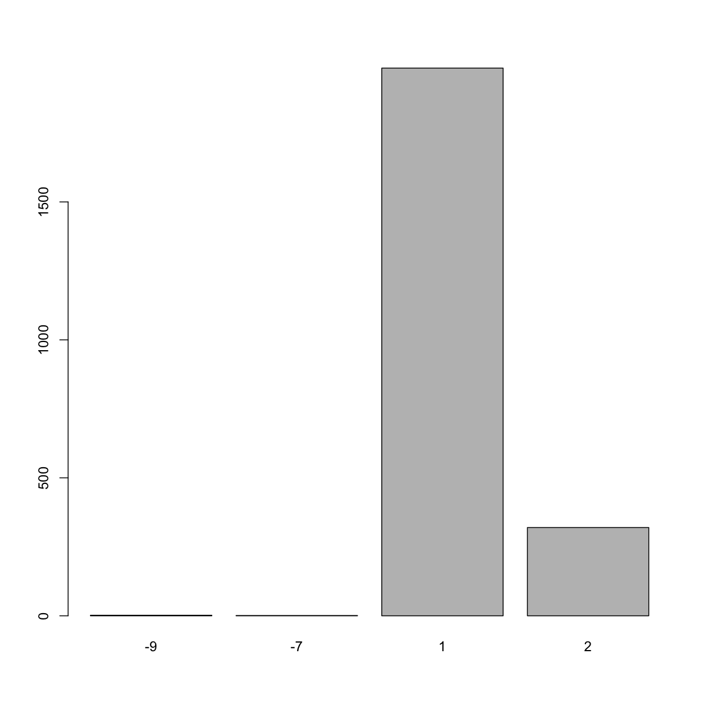
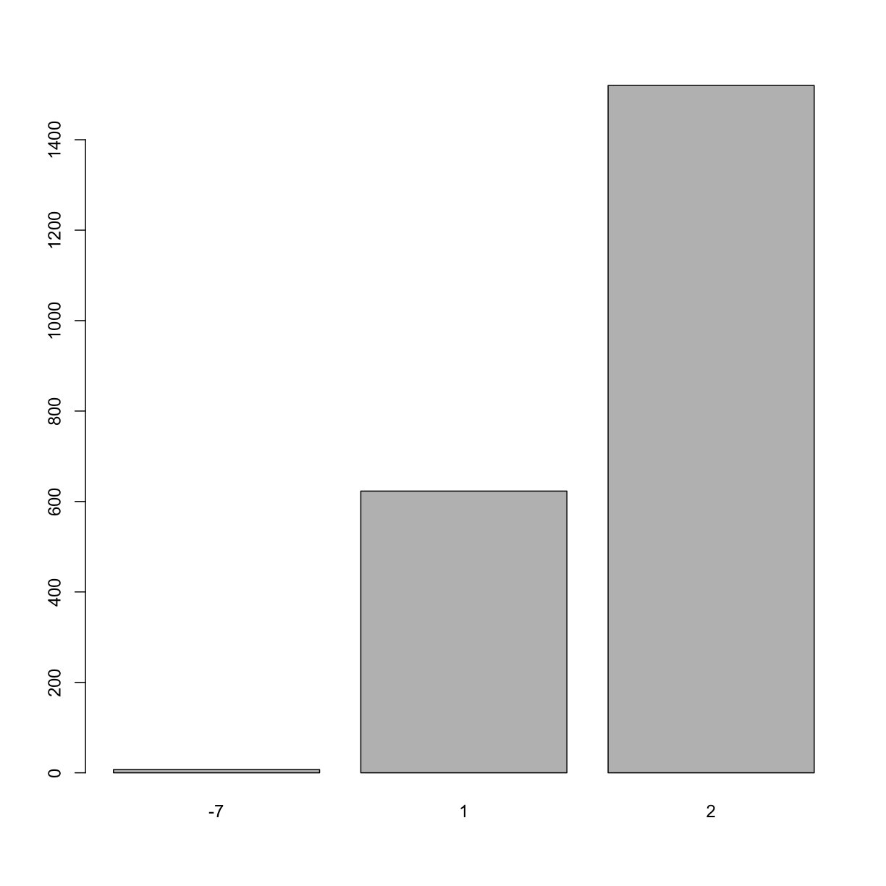

---
# Please do not edit this file directly; it is auto generated.
# Instead, please edit 08-exploring-categorical-data.md in _episodes_rmd/
title: "Exploring Categorical Data"
teaching: 45
exercises: 10
questions:
- "How can I tabulate frequencies of a single categorical variable?"
- "How can I tabulate contingency tables?"
- "How can I generate a bar chart to visualize categorical data?"
- "How can I check for missing data?"
- "MAYBE: Cross-correlations??"
objectives:
- "Learn how to ..."
keypoints:
- "Use `table()` to calculate frequencies"
- "Use ... something to calculate % frequencies"
- "Use barplot()"
source: Rmd
---


~~~
colnames(analysis_swan_df)
~~~
{: .language-r}


~~~
 [1] "SWANID"     "Age"        "RACE"       "BMI"        "Glucose"   
 [6] "Smoker"     "LDL"        "HDL"        "CRP"        "DBP"       
[11] "SBP"        "Exercise"   "log_CRP"    "Chol_Ratio"
~~~
{: .output}

Three variables that are categorical at the moment are :Race, Smoker, and Exercise.


~~~
barplot(table(analysis_swan_df$Smoker))
~~~
{: .language-r}


In this barplot of `Smoker` we notice that there four distinct values for this variable.  In most health data, a common convention is to denote responses such as "did not answer", "don't know" using `-7`, `-9` or `-9999` etc. Missing values in health data can give scientists and data analyists valueable information that explains the nature of "missingness".  So, an particular subject may not be attend his visit appointment due to severe illness (an illness that the study has an interest in) or he may not attend the visit due to lack of transportation. That information has to be recorded in a manner that can be meaningful during the data analysis phase.  This type of information is particularly informative for clinical trials and in studies of cancer etc. 

So, in lognitudinal analysis of this data, we may want to utilize this information on missingness accroding to the analysis of interest.  In our cross-sectional analysis of this particular time point (year 2002 - 2004), we are going to treat all missing values are simply missing and designate as `NA`. 


~~~
class(analysis_swan_df$Smoker)
~~~
{: .language-r}


~~~
[1] "integer"
~~~
{: .output}


~~~
typeof(analysis_swan_df$Smoker)
~~~
{: .language-r}


~~~
[1] "integer"
~~~
{: .output}


~~~
str(analysis_swan_df$Smoker)
~~~
{: .language-r}


~~~
 int [1:2424] 1 1 NA 1 1 1 2 1 1 NA ...
~~~
{: .output}
Let's convert `-7` and `-9` to `NA` first.

~~~
analysis_swan_df$Smoker[analysis_swan_df$Smoker == -7] <- NA
analysis_swan_df$Smoker[analysis_swan_df$Smoker == -9] <- NA
~~~
{: .language-r}


~~~
analysis_swan_df$Smoker <- as.factor(analysis_swan_df$Smoker)
~~~
{: .language-r}


~~~
class(analysis_swan_df$Smoker)
~~~
{: .language-r}


~~~
[1] "factor"
~~~
{: .output}


~~~
typeof(analysis_swan_df$Smoker)
~~~
{: .language-r}


~~~
[1] "integer"
~~~
{: .output}


~~~
str(analysis_swan_df$Smoker)
~~~
{: .language-r}


~~~
 Factor w/ 2 levels "1","2": 1 1 NA 1 1 1 2 1 1 NA ...
~~~
{: .output}


~~~
levels(analysis_swan_df$Smoker)
~~~
{: .language-r}


~~~
[1] "1" "2"
~~~
{: .output}

We see that there are two levels for this factor variable. 1 is `No` and 2 is `Yes` for survey question: `Since your last study visit, have you smoked cigarettes regularly (at least one cigarette a day)?` Let's relabel with NO and YES. Keep in mind that when you assign labels, they are in the same order as the levels.


~~~
levels(analysis_swan_df$Smoker) <- c('No','Yes')
levels(analysis_swan_df$Smoker)
~~~
{: .language-r}


~~~
[1] "No"  "Yes"
~~~
{: .output}
Let's recreate the bar chart to see how it changed.

~~~
barplot(table(analysis_swan_df$Smoker))
~~~
{: .language-r}


We can't just use bar plot and inspect visually, we want to make sure that categorical variables have at least five observations in each category (cell).  In order to check, let's create a frequency count table. 

~~~
table(analysis_swan_df$Smoker)
~~~
{: .language-r}


~~~

  No  Yes 
1985  320 
~~~
{: .output}

> ## Tip: Another way to relabel levels in factor variables
> 
> ~~~
> levels(analysis_swan_df$Smoker) <- c(NA, NA, "No", "Yes")
> ~~~
> {: .language-r}
{: .callout}

#TODO show how to make a contingency table and maybe even a tableone. 

> ## Exercise
> 
> Explore variable `Exercise` in `analysis_swan_df`, factorize the variable, relevel and label 1 = Yes, 2 = No
> 
> > ## Solution
> >
> > 
> > ~~~
> > barplot(table(analysis_swan_df$Exercise))
> > ~~~
> > {: .language-r}
> > 
> > 
> > 
> > ~~~
> > class(analysis_swan_df$Exercise)
> > ~~~
> > {: .language-r}
> > 
> > 
> > 
> > ~~~
> > [1] "integer"
> > ~~~
> > {: .output}
> > 
> > 
> > 
> > ~~~
> > typeof(analysis_swan_df$Exercise)
> > ~~~
> > {: .language-r}
> > 
> > 
> > 
> > ~~~
> > [1] "integer"
> > ~~~
> > {: .output}
> > 
> > 
> > 
> > ~~~
> > str(analysis_swan_df$Exercise)
> > ~~~
> > {: .language-r}
> > 
> > 
> > 
> > ~~~
> >  int [1:2424] 2 2 NA 2 2 1 2 2 2 NA ...
> > ~~~
> > {: .output}
> > 
> > 
> > 
> > ~~~
> > analysis_swan_df$Exercise[analysis_swan_df$Exercise == -7] <- NA
> > analysis_swan_df$Exercise <- as.factor(analysis_swan_df$Exercise)
> > class(analysis_swan_df$Exercise)
> > ~~~
> > {: .language-r}
> > 
> > 
> > 
> > ~~~
> > [1] "factor"
> > ~~~
> > {: .output}
> > 
> > 
> > 
> > ~~~
> > typeof(analysis_swan_df$Exercise)
> > ~~~
> > {: .language-r}
> > 
> > 
> > 
> > ~~~
> > [1] "integer"
> > ~~~
> > {: .output}
> > 
> > 
> > 
> > ~~~
> > str(analysis_swan_df$Exercise)
> > ~~~
> > {: .language-r}
> > 
> > 
> > 
> > ~~~
> >  Factor w/ 2 levels "1","2": 2 2 NA 2 2 1 2 2 2 NA ...
> > ~~~
> > {: .output}
> > 
> > 
> > 
> > ~~~
> > levels(analysis_swan_df$Exercise)
> > ~~~
> > {: .language-r}
> > 
> > 
> > 
> > ~~~
> > [1] "1" "2"
> > ~~~
> > {: .output}
> > 
> > 
> > 
> > ~~~
> > levels(analysis_swan_df$Exercise) <- c('No','Yes')
> > levels(analysis_swan_df$Exercise)
> > ~~~
> > {: .language-r}
> > 
> > 
> > 
> > ~~~
> > [1] "No"  "Yes"
> > ~~~
> > {: .output}
> >
> {: .solution}
{: .challenge}


# TODO Race variable factorize

<!-- #TODO: do all below -->
<!-- ```{r} -->
<!-- analysis_swan_df$BMI_cat <- cut(analysis_swan_df$BMI6, breaks = c(0, 18.5, 25.0, 30.0, 35.0, 40, 100), labels = c("Underweight", "Normal", "Pre-obese", "Obesity I", "Obesity II", "Obesity III"), right = FALSE) -->

<!-- analysis_swan_df$BMI_cat <- relevel(analysis_swan_df$BMI_cat, "Normal") #this sets "normal" as the reference category. -->

<!-- summary(analysis_swan_df$BMI_cat) -->
<!-- ``` -->


<!-- BLOOD PRESSURE CATEGORIES: -->
<!-- https://www.heart.org/-/media/data-import/downloadables/pe-abh-what-is-high-blood-pressure-ucm_300310.pdf -->

<!-- 6. Let's create catgegories for variables we are intersted in. -->
<!-- ```{r, eval=TRUE} -->
<!-- bp_cat <- function(sbp, dbp) { -->
<!--  if (is.na(sbp) | is.na(dbp)){ -->
<!--    return(NA) -->
<!--  } -->
<!--   #if (sbp>=180 | dbp >=120) { -->
<!--    # return("Hypertensive Crisis") -->
<!--   #} -->
<!-- if (sbp>=140 | dbp >=90) { -->
<!--     return("Hypertension Stage 2+") -->
<!--   } -->

<!-- if ((sbp>=130 & sbp<=139) | (dbp >=80 & dbp <=89)) { -->
<!--     return("Hypertension Stage 1") -->
<!--   } -->

<!--  if ((sbp>=120 & sbp<=129) &  dbp <80) { -->
<!--     return("Elevated") -->
<!--   } -->

<!--   if (sbp < 120 & dbp <80) { -->
<!--     return("Normal")  -->
<!--   } -->
<!-- }  -->
<!-- ```   -->


<!-- ```{r, eval=TRUE} -->
<!-- # Converting Blood pressure into categories -->
<!-- analysis_swan_df$bp_category <- mapply(bp_cat, analysis_swan_df$SBP, analysis_swan_df$DBP) -->

<!-- str(analysis_swan_df$bp_category) -->
<!-- analysis_swan_df$bp_category <- as.factor(analysis_swan_df$bp_category) -->
<!-- analysis_swan_df$bp_category <- relevel(analysis_swan_df$bp_category, "Normal") #this sets "normal" as the reference category. -->
<!-- ``` -->

## Introduction goes here

Histograms

Looking for null values

some basic filtering - for example, filter just to women of childbearing age, check for % of NA to pregnancy question

Checking normality of continuous 

Data cleanliness - boxplots, look for outliers

