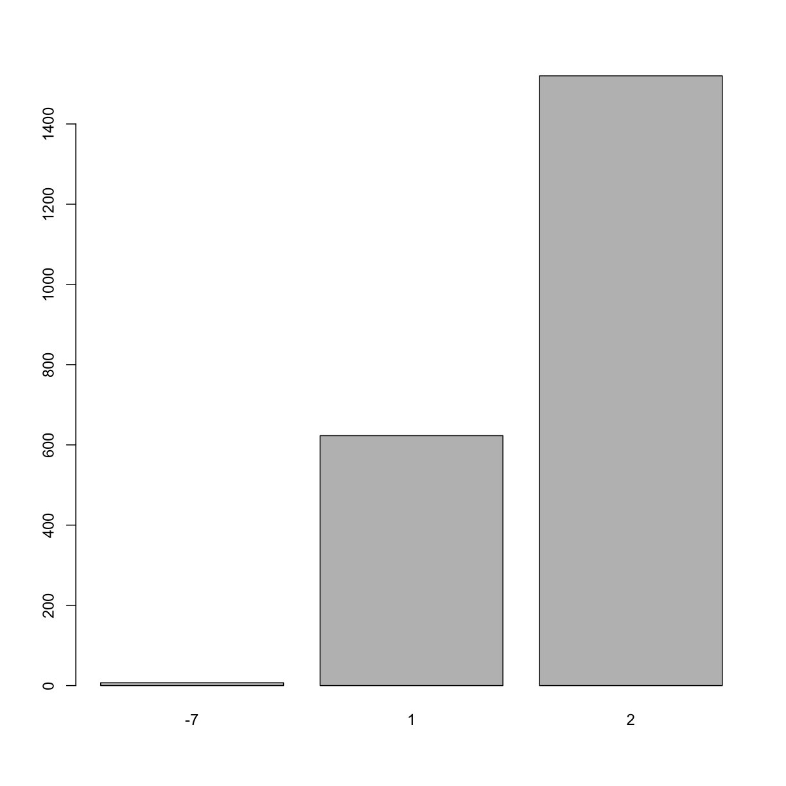

---
# Please do not edit this file directly; it is auto generated.
# Instead, please edit 08-exploring-categorical-data.md in _episodes_rmd/
title: "Exploring Categorical Data"
teaching: 45
exercises: 10
questions:
- "How can I tabulate frequencies of a single categorical variable?"
- "How can I tabulate contingency tables?"
- "How can I generate a bar chart to visualize categorical data?"
- "How can I check for missing data?"
- "MAYBE: Cross-correlations??"
objectives:
- "Learn how to ..."
keypoints:
- "Use `table()` to calculate frequencies"
- "Use ... something to calculate % frequencies"
- "Use barplot()"
source: Rmd
---


We are going to assess categorical variables just like we did for continuous variables. 

~~~
str(analysis_swan_df)
~~~
{: .language-r}


~~~
'data.frame':	2424 obs. of  14 variables:
 $ SWANID    : int  10046 10056 10126 10153 10196 10245 10484 10514 10522 10532 ...
 $ Age       : int  58 57 54 57 52 54 56 52 52 49 ...
 $ RACE      : int  2 4 1 3 2 4 1 4 4 4 ...
 $ BMI       : num  35.6 19.8 26.4 31.6 22.3 ...
 $ Glucose   : int  116 89 82 85 80 88 111 101 83 91 ...
 $ Smoker    : int  1 1 NA 1 1 1 2 1 1 NA ...
 $ LDL       : int  137 90 136 154 130 129 93 137 103 128 ...
 $ HDL       : int  48 78 57 55 59 83 47 39 65 41 ...
 $ CRP       : num  8.7 0.5 1.5 2.7 0.3 1.3 7.4 1.3 1.1 1.5 ...
 $ DBP       : int  72 62 80 68 62 64 68 70 58 70 ...
 $ SBP       : int  134 96 102 108 94 94 130 124 102 118 ...
 $ Exercise  : int  2 2 NA 2 2 1 2 2 2 NA ...
 $ log_CRP   : num  2.163 -0.693 0.405 0.993 -1.204 ...
 $ Chol_Ratio: num  3.85 2.15 3.39 3.8 3.2 ...
~~~
{: .output}


~~~
colnames(analysis_swan_df)
~~~
{: .language-r}


~~~
 [1] "SWANID"     "Age"        "RACE"       "BMI"        "Glucose"   
 [6] "Smoker"     "LDL"        "HDL"        "CRP"        "DBP"       
[11] "SBP"        "Exercise"   "log_CRP"    "Chol_Ratio"
~~~
{: .output}

Three variables that are categorical at the moment are: Race, Smoker, and Exercise.  We can also refer to the data dictionary that comes with SWAN dataset.


~~~
barplot(table(analysis_swan_df$Smoker))
~~~
{: .language-r}


In this barplot of `Smoker` we notice that there are four distinct values for this variable.  In most health data, a common convention is to denote responses such as "did not answer", "don't know" using `-7`, `-9` or `-9999` etc. Missing values in health data can give scientists and data analyists valueable information that explains the nature of "missingness".  So, an particular subject may not be attend his visit appointment due to severe illness (an illness that the study has an interest in) or he may not attend the visit due to lack of transportation. That information has to be recorded in a manner that can be meaningful during the data analysis phase.  This type of information is particularly informative for clinical trials and in studies of cancer etc. 

So, in lognitudinal analysis of this data, we may want to utilize this information on missingness accroding to the analysis of interest.  In our cross-sectional analysis of this particular time point (year 2002 - 2004), we are going to treat all missing values are simply missing and designate as `NA`. 


We can look at this variable in more detail and confirm that its values are integers

~~~
str(analysis_swan_df$Smoker)
~~~
{: .language-r}


~~~
 int [1:2424] 1 1 NA 1 1 1 2 1 1 NA ...
~~~
{: .output}

Let's convert `-7` and `-9` to `NA` first.

~~~
analysis_swan_df$Smoker[analysis_swan_df$Smoker == -7] <- NA
analysis_swan_df$Smoker[analysis_swan_df$Smoker == -9] <- NA
~~~
{: .language-r}

Next, we are going to convert this to a factor variable.  In a regression model, we want to have this variable treated as a categorical and for this we have to convert it from an integer to a factor.  

As you might recall from episode 3, factor variables in R represent categorical data.  In the example of smoker variable, 1 and 2 don't represent quantities, they represent survey answers of Yes and No. 

We are going to overwrite the `Smoker` variable with the result of creating a factor variable from the `Smoker` data.

~~~
analysis_swan_df$Smoker <- factor(analysis_swan_df$Smoker)
~~~
{: .language-r}

Let's look at the result of "factorizing" the `Smoker` variable.  

~~~
str(analysis_swan_df$Smoker)
~~~
{: .language-r}


~~~
 Factor w/ 2 levels "1","2": 1 1 NA 1 1 1 2 1 1 NA ...
~~~
{: .output}

We can get back the category names using the `levels()` function.

~~~
levels(analysis_swan_df$Smoker)
~~~
{: .language-r}


~~~
[1] "1" "2"
~~~
{: .output}
We see that there are two levels for this factor variable. 1 is `No` and 2 is `Yes` for survey question: `Since your last study visit, have you smoked cigarettes regularly (at least one cigarette a day)?` Let's relabel with NO and YES. Keep in mind that when you assign labels, they are in the same order as the levels.


~~~
levels(analysis_swan_df$Smoker) <- c('No','Yes')
~~~
{: .language-r}

Let's observed that the names of the levels changed. 

~~~
levels(analysis_swan_df$Smoker)
~~~
{: .language-r}


~~~
[1] "No"  "Yes"
~~~
{: .output}
Let's recreate the bar chart to see how it changed.

~~~
barplot(table(analysis_swan_df$Smoker))
~~~
{: .language-r}


We can't just use bar plot and inspect visually, we want to make sure that categorical variables have at least five observations in each category (cell).  In order to check, let's create a frequency count table. 

~~~
table(analysis_swan_df$Smoker)
~~~
{: .language-r}


~~~

  No  Yes 
1985  320 
~~~
{: .output}
We can also use `prop.table()` function to convert the frequencies to percentages. 

~~~
prop.table(table(analysis_swan_df$Smoker))
~~~
{: .language-r}


~~~

       No       Yes 
0.8611714 0.1388286 
~~~
{: .output}

> ## Exercise
> 
> Explore variable `Exercise` in `analysis_swan_df`, factorize the variable, relevel and label 1 = Yes, 2 = No
> 
> > ## Solution
> >
> > 
> > ~~~
> > barplot(table(analysis_swan_df$Exercise))
> > ~~~
> > {: .language-r}
> > 
> > 
> > 
> > ~~~
> > str(analysis_swan_df$Exercise)
> > ~~~
> > {: .language-r}
> > 
> > 
> > 
> > ~~~
> >  int [1:2424] 2 2 NA 2 2 1 2 2 2 NA ...
> > ~~~
> > {: .output}
> > 
> > 
> > 
> > ~~~
> > analysis_swan_df$Exercise[analysis_swan_df$Exercise == -7] <- NA
> > analysis_swan_df$Exercise <- as.factor(analysis_swan_df$Exercise)
> > str(analysis_swan_df$Exercise)
> > ~~~
> > {: .language-r}
> > 
> > 
> > 
> > ~~~
> >  Factor w/ 2 levels "1","2": 2 2 NA 2 2 1 2 2 2 NA ...
> > ~~~
> > {: .output}
> > 
> > 
> > 
> > ~~~
> > levels(analysis_swan_df$Exercise)
> > ~~~
> > {: .language-r}
> > 
> > 
> > 
> > ~~~
> > [1] "1" "2"
> > ~~~
> > {: .output}
> > 
> > 
> > 
> > ~~~
> > levels(analysis_swan_df$Exercise) <- c('No','Yes')
> > levels(analysis_swan_df$Exercise)
> > ~~~
> > {: .language-r}
> > 
> > 
> > 
> > ~~~
> > [1] "No"  "Yes"
> > ~~~
> > {: .output}
> >
> {: .solution}
{: .challenge}


Let's look at our last categorical vaiable `Race` which is also still an `integer`. We will factorize this variable as well and rename the levels as follows: `Black`, `Chinese`, `Japanese`, `Caucasian`, `Hispanic`. 

~~~
str(analysis_swan_df$RACE)
~~~
{: .language-r}


~~~
 int [1:2424] 2 4 1 3 2 4 1 4 4 4 ...
~~~
{: .output}

As an integer vector, if we try to do `levels` on this variable, we will get `NULL`. 

~~~
levels(analysis_swan_df$RACE)
~~~
{: .language-r}


~~~
NULL
~~~
{: .output}

Once we factorize it, it should show us the actual `categories`. 

~~~
analysis_swan_df$RACE <- as.factor(analysis_swan_df$RACE)
~~~
{: .language-r}

Let's recheck the levels 

~~~
levels(analysis_swan_df$RACE)
~~~
{: .language-r}


~~~
[1] "1" "2" "3" "4" "5"
~~~
{: .output}

Next, we want to rename: 

~~~
levels(analysis_swan_df$RACE) <- c('Black','Chinese', 
                          'Japanese', 'Caucasian',
                          'Hispanic')
~~~
{: .language-r}

Let's take a look at the whole dataframe before we move forward

~~~
str(analysis_swan_df)
~~~
{: .language-r}


~~~
'data.frame':	2424 obs. of  14 variables:
 $ SWANID    : int  10046 10056 10126 10153 10196 10245 10484 10514 10522 10532 ...
 $ Age       : int  58 57 54 57 52 54 56 52 52 49 ...
 $ RACE      : Factor w/ 5 levels "Black","Chinese",..: 2 4 1 3 2 4 1 4 4 4 ...
 $ BMI       : num  35.6 19.8 26.4 31.6 22.3 ...
 $ Glucose   : int  116 89 82 85 80 88 111 101 83 91 ...
 $ Smoker    : Factor w/ 2 levels "No","Yes": 1 1 NA 1 1 1 2 1 1 NA ...
 $ LDL       : int  137 90 136 154 130 129 93 137 103 128 ...
 $ HDL       : int  48 78 57 55 59 83 47 39 65 41 ...
 $ CRP       : num  8.7 0.5 1.5 2.7 0.3 1.3 7.4 1.3 1.1 1.5 ...
 $ DBP       : int  72 62 80 68 62 64 68 70 58 70 ...
 $ SBP       : int  134 96 102 108 94 94 130 124 102 118 ...
 $ Exercise  : Factor w/ 2 levels "No","Yes": 2 2 NA 2 2 1 2 2 2 NA ...
 $ log_CRP   : num  2.163 -0.693 0.405 0.993 -1.204 ...
 $ Chol_Ratio: num  3.85 2.15 3.39 3.8 3.2 ...
~~~
{: .output}

Now that variables have been fixed, we want to use these variables in a meaningful way.  BMI is a good indicator of health and is often expressed as categories rather than as continuous changes in values.


We are going to use the `cut()` function to create BMI categories. Let's see how the documentation describes `cut()`. 

```
Cut divides the range of x into intervals and codes the values in x according to which interval they fall. The leftmost interval corresponds to level one, the next leftmost to level two and so on.
```
We should note that the result of cut is a factor variable. 

~~~
analysis_swan_df$BMI_cat <- cut(analysis_swan_df$BMI, breaks = c(0, 18.5, 25.0, 30.0, 35.0, 40, 100), labels = c("Underweight", "Normal", "Pre-obese", "Obesity I", "Obesity II", "Obesity III"), right = FALSE)
~~~
{: .language-r}

We have ow created a new factor variable `BMI_cat`. 

~~~
str(analysis_swan_df$BMI_cat)
~~~
{: .language-r}


~~~
 Factor w/ 6 levels "Underweight",..: 5 2 3 4 2 3 4 4 2 4 ...
~~~
{: .output}

Let's see how the categories came out and whether we need to `relevel()` to change the reference category to one that may be more meaningful for comparison.

~~~
summary(analysis_swan_df$BMI_cat)
~~~
{: .language-r}


~~~
Underweight      Normal   Pre-obese   Obesity I  Obesity II Obesity III 
         30         725         590         372         228         174 
       NA's 
        305 
~~~
{: .output}


~~~
analysis_swan_df$BMI_cat <- relevel(analysis_swan_df$BMI_cat, "Normal") #this sets "normal" as the reference category.
~~~
{: .language-r}

Once we relevel, we can see that `Normal` is now the first category. 

~~~
summary(analysis_swan_df$BMI_cat)
~~~
{: .language-r}


~~~
     Normal Underweight   Pre-obese   Obesity I  Obesity II Obesity III 
        725          30         590         372         228         174 
       NA's 
        305 
~~~
{: .output}

Similar to BMI, we want to assess blood pressure readings as one categorical variable.  This will be a function of two numbers. 

We will use blood pressure categories defined by the American Heart Association (AHA). https://www.heart.org/-/media/data-import/downloadables/pe-abh-what-is-high-blood-pressure-ucm_300310.pdf

We previously learned that we can our own functions in R. 

We want a new variable in the dataframe that is a function of the two continuous variables `SBP` and `DBP` and is itself a categorical variable. Unlike above where we computed `Chol_Ratio`, we can't just use simple math or build-in functions to compute the blood pressure categories.  We need to apply the rules as defined by the AHA categories.  For this, we will need to create our own function.  We previously learned how to do this in Episode 3.  

Let's call this function `bp_cat`.  We want it to work like this: 
For a subject with normal blood pressure reading of 118/75 mmHg, `bp_cat(120, 80)` should return the string `Normal`.  For a subject whose blood pressure readings are `bp_cat(122, 76)` returns `Elevated`. 

One other thing we might wanna consider is that we often have missing data and the function should return `NA` in that case.  


~~~
bp_cat <- function(sbp, dbp) {
 if (is.na(sbp) | is.na(dbp)){
   return(NA)
 }
  #if (sbp>=180 | dbp >=120) {
   # return("Hypertensive Crisis")
  #}
if (sbp>=140 | dbp >=90) {
    return("Hypertension Stage 2+")
  }

if ((sbp>=130 & sbp<140) | (dbp >=80 & dbp <90)) {
    return("Hypertension Stage 1")
  }

 if ((sbp>=120 & sbp<130) &  dbp <80) {
    return("Elevated")
  }

  if (sbp < 120 & dbp <80) {
    return("Normal")
  }
}
~~~
{: .language-r}

#TODO: Explain mapply

~~~
# Converting Blood pressure into categories
analysis_swan_df$bp_category <- mapply(bp_cat, analysis_swan_df$SBP, analysis_swan_df$DBP)
~~~
{: .language-r}


~~~
str(analysis_swan_df$bp_category)
~~~
{: .language-r}


~~~
 chr [1:2424] "Hypertension Stage 1" "Normal" "Hypertension Stage 1" ...
~~~
{: .output}


~~~
analysis_swan_df$bp_category <- as.factor(analysis_swan_df$bp_category)
~~~
{: .language-r}


~~~
analysis_swan_df$bp_category <- relevel(analysis_swan_df$bp_category, "Normal") #this sets "normal" as the reference category.
~~~
{: .language-r}


~~~
summary(analysis_swan_df$bp_category)
~~~
{: .language-r}


~~~
               Normal              Elevated  Hypertension Stage 1 
                 1105                   269                   456 
Hypertension Stage 2+                  NA's 
                  302                   292 
~~~
{: .output}


## Introduction goes here

Histograms

Looking for null values

some basic filtering - for example, filter just to women of childbearing age, check for % of NA to pregnancy question

Checking normality of continuous 

Data cleanliness - boxplots, look for outliers

