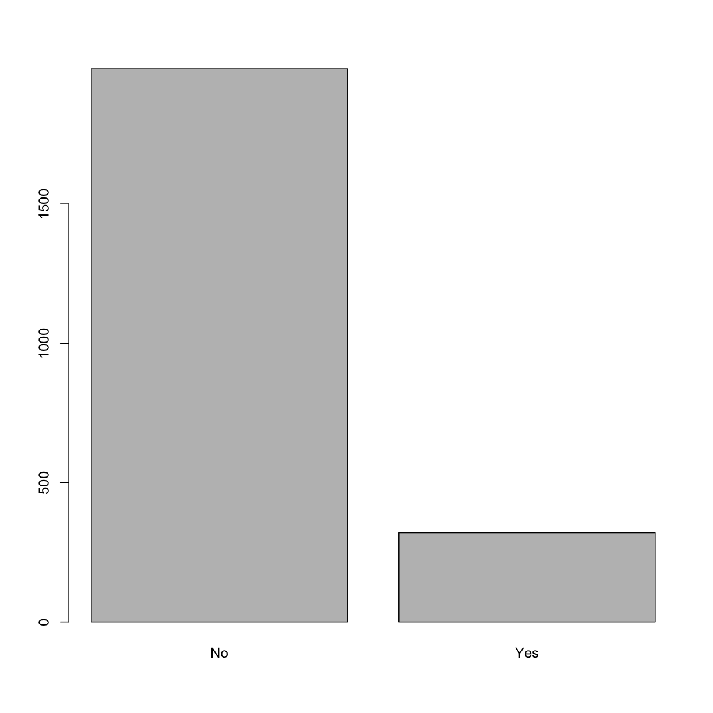
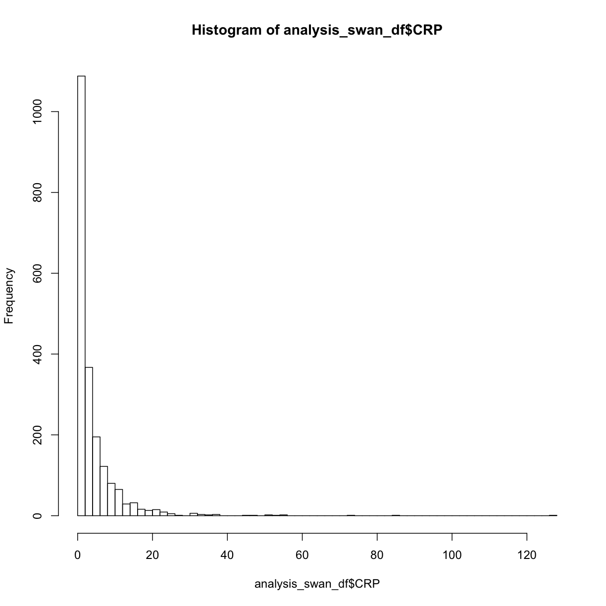

---
# Please do not edit this file directly; it is auto generated.
# Instead, please edit 08-merging-data.md in _episodes_rmd/
title: "Merging and Joining Data"
keypoints:
- Use `merge()` to stack data
- Use `merge()` to join data
- Understand joins
objectives:
- Learn how to stack data frames (ex. different years' data)
- Learn how to join - inner, outer, etc.
- Explore after a join to verify results as expected
questions: How can I combine data from different sources?
source: Rmd
teaching: 45
exercises: 10
---

## Combining data from multiple files

Often, the observations of the study participants may be distributed across many different data files.  For example, one file might contain a table with demographics, with one row per participant.  Another file might contain laboratory measurements for some or all of those participants.

To perform your analysis, though, you probably want all of the demographics and laboratory data of interest in a single table which has one row for each participant.

In order to do this, first we'll need to load each of the separate data files into data.frame objects in R.  Once we've done that, we'll be able to use R functions to combine them.

First, let's get the libraries/packages we'll need:

~~~
library(SASxport)
library(tidyverse)
library(survey) # for using survey weights
# survey::svydesign, svymean, svyglm
library(jtools) # for svycor
~~~
{: .language-r}

## A word about packages -- interpreting warnings, masking, and more

Notice that when you ran `library(tidyverse)`, some warnings showed up on the console.  The red Xs might have made you think something went wrong!

Let's break that part of the output down a bit:

TODO: Replace with screenshot or figure out how to colorize text: 
~~~
── Conflicts ────────────────────────────────────── tidyverse_conflicts() ──
✖ dplyr::filter() masks stats::filter()
✖ dplyr::lag()    masks stats::lag()
~~~

This is telling us that two functions, `filter()` and `log()` from the `dplyr` package **masked** two functions with the same names in the `stats` package, which is always available in R (you don't need to run `install.packages` or `library` to use it).  By **masking**, this means that if you have code that uses the `filter()` function, R is going to give precedence to the package you installed later, and R will assume you meant `filter()` from `dplyr`.

Now what if you still want to use `filter()` from `stats`?  Well, there's a hint in the output above.  You can call it by being more explicit and including the package name, referencing it as `stats::filter()`.

You might also be wondering: But I thought I installed `tidyverse`, not `dplyr`!  Packages can have **dependencies**, meaning that one package needs, or depends on, another.  In this case, `tidyverse` has several dependencies, one of which is `dplyr`, so when you install `tidyverse`, several other packages are installed with it:  `dplyr`, `magrittr`, `ggplot2`, and others.  You definitely _can_ just install the ones you want, instead of the `tidyverse` package which brings all of them in.

~~~
# Demographics data file
demographics <- read.xport('data/DEMO_I.XPT')

# Laboratory data files
bmi_df <- read.xport('data/BMX_I.XPT') 
bp_df <- read.xport('data/BPX_I.XPT')
cbc_df <- read.xport('data/CBC_I.XPT')
glu_df <- read.xport('data/GLU_I.XPT')
tg_df <- read.xport('data/TRIGLY_I.XPT')
hdl_df <- read.xport('data/HDL_I.XPT')
tc_df <- read.xport('data/TCHOL_I.XPT')
# smk_df <- read.xport('data/SMQ_I.XPT')
~~~
{: .language-r}

Let's take a quick look at the variables in the demographics file:

~~~
colnames(demographics)
~~~
{: .language-r}

~~~
 [1] "SEQN"     "SDDSRVYR" "RIDSTATR" "RIAGENDR" "RIDAGEYR" "RIDAGEMN"
 [7] "RIDRETH1" "RIDRETH3" "RIDEXMON" "RIDEXAGM" "DMQMILIZ" "DMQADFC" 
[13] "DMDBORN4" "DMDCITZN" "DMDYRSUS" "DMDEDUC3" "DMDEDUC2" "DMDMARTL"
[19] "RIDEXPRG" "SIALANG"  "SIAPROXY" "SIAINTRP" "FIALANG"  "FIAPROXY"
[25] "FIAINTRP" "MIALANG"  "MIAPROXY" "MIAINTRP" "AIALANGA" "DMDHHSIZ"
[31] "DMDFMSIZ" "DMDHHSZA" "DMDHHSZB" "DMDHHSZE" "DMDHRGND" "DMDHRAGE"
[37] "DMDHRBR4" "DMDHREDU" "DMDHRMAR" "DMDHSEDU" "WTINT2YR" "WTMEC2YR"
[43] "SDMVPSU"  "SDMVSTRA" "INDHHIN2" "INDFMIN2" "INDFMPIR"
~~~
{: .output}

And now let's take a quick look at one of the other files to see which variables are in it:

~~~
colnames(bmi_df)
~~~
{: .language-r}

~~~
 [1] "SEQN"     "BMDSTATS" "BMXWT"    "BMIWT"    "BMXRECUM" "BMIRECUM"
 [7] "BMXHEAD"  "BMIHEAD"  "BMXHT"    "BMIHT"    "BMXBMI"   "BMDBMIC" 
[13] "BMXLEG"   "BMILEG"   "BMXARML"  "BMIARML"  "BMXARMC"  "BMIARMC" 
[19] "BMXWAIST" "BMIWAIST" "BMXSAD1"  "BMXSAD2"  "BMXSAD3"  "BMXSAD4" 
[25] "BMDAVSAD" "BMDSADCM"
~~~
{: .output}

While it's great that the study measured 25 variables for each participant (idenfied by their SEQN value), we'll end up with a lot of varibles that we don't need for our analysis if we merge the entire table and all of its variables onto our demographics data.  Sometimes you want to keep all of the variables, but many times you only want some.

Now that we have all the files read in, let's merge.

From bmi_df we are keeping: BMXBMI
from bp_df: PBXPLS (pules), BPXSY1 (SBP), PBXDI1 (DPB),
tg_df : LBXTR (triglycerides mg/dL), LBDLDL (LDL mg/dL)
tc_df: LBXTC (total chol mg/dL)
hdl_df: LBDHDD (HDL mg/dL)
cbc_df: LBXWBCSI (WBCs 1000cells/uL)
glu_df: LBXGLU (glucose fasting mg/dL)

HERE WE NEED TO CONSIDER DPLYR FOR JOINING. #TODO

~~~
merge_df <- merge(demographics, bmi_df[ ,c("SEQN", "BMXBMI")])
merge_df <- merge (merge_df, bp_df[ ,c("SEQN", "BPXSY1", "BPXDI1")])
merge_df <- merge(merge_df, tg_df[ , c("SEQN", "LBXTR", "LBDLDL", "WTSAF2YR")])
merge_df <- merge(merge_df, tc_df[ , c("SEQN", "LBXTC")])
merge_df <- merge(merge_df, hdl_df[ , c("SEQN", "LBDHDD")])
merge_df <- merge(merge_df, cbc_df[ , c("SEQN", "LBXWBCSI")])
merge_df <- merge(merge_df, glu_df[ , c("SEQN", "LBXGLU")])
~~~
{: .language-r}

~~~
write.csv(merge_df, file = 'data_out/merge.csv', row.names = FALSE)
~~~
{: .language-r}

Import the merge_df so we don't have to merge everytime.

~~~
merge_df <- read.csv("data_out/merge.csv")
~~~
{: .language-r}

Select variables of interest only.  This also have sampling weight vars.

~~~
merge_df <- merge_df %>% select(SEQN, BMXBMI, RIDAGEYR, BPXSY1, BPXDI1, LBDLDL, LBXTC, LBDHDD, LBXGLU, WTSAF2YR,  SDMVPSU, SDMVSTRA) # WTINT2YR, WTMEC2YR --> not using these 2 weigths.  Instead we are using WTSAF2YR b/c it belongs to the smallest subset.
# see: https://wwwn.cdc.gov/nchs/nhanes/tutorials/module3.aspx
~~~
{: .language-r}

Weights: Use "svydesign" to assign the weights

~~~
tg_design <- svydesign(id = ~SDMVPSU,
                      strata = ~SDMVSTRA,
                      weights = ~WTSAF2YR, 
                      nest = TRUE,
                      data = merge_df)
# The svydesign object combines a data frame and all the survey design information needed to analyse it.
# tg for triglycerides
~~~
{: .language-r}

# let's subset on age:

~~~
# merge25_df <- merge_df %>% filter((RIDAGEYR>=25 & RIDAGEYR<80)) 
# looks like filter doesn't work once you use svydesign so have to subset.
tg_design2 <- subset(tg_design, RIDAGEYR>=25 & 
                                RIDAGEYR<80) 
~~~
{: .language-r}

Variables of interest:
BMI, BP, LDL, TC, HDL, GLU, AGE,
-We are interested in the association between TC and BMI categories. (Total chol (TC) = outcome and glucose (main predictor))

1. After merging, first look at NAs and summaries of variables.

~~~
# Look at descriptive statistics of all independent variables
svymean(~RIDAGEYR, tg_design2, na.rm = TRUE) # RIDAGEYR Mean:49.24 SE:0.6123
~~~
{: .language-r}

~~~
          mean     SE
RIDAGEYR 49.24 0.6123
~~~
{: .output}

~~~
summary(tg_design2) # let's not worry about the output from here at the moment. 
~~~
{: .language-r}

~~~
Stratified 1 - level Cluster Sampling design (with replacement)
With (30) clusters.
subset(tg_design, RIDAGEYR >= 25 & RIDAGEYR < 80)
Probabilities:
     Min.   1st Qu.    Median      Mean   3rd Qu.      Max. 
1.917e-06 1.020e-05 1.775e-05       Inf 3.175e-05       Inf 
Stratum Sizes: 
           119 120 121 122 123 124 125 126 127 128 129 130 131 132 133
obs        102 128 150 123 133 158 173 144 163 150 165 154 171 180 151
design.PSU   2   2   2   2   2   2   2   2   2   2   2   2   2   2   2
actual.PSU   2   2   2   2   2   2   2   2   2   2   2   2   2   2   2
Data variables:
 [1] "SEQN"     "BMXBMI"   "RIDAGEYR" "BPXSY1"   "BPXDI1"   "LBDLDL"  
 [7] "LBXTC"    "LBDHDD"   "LBXGLU"   "WTSAF2YR" "SDMVPSU"  "SDMVSTRA"
~~~
{: .output}

~~~
# LBXTC is total chol = OUTCOME variable.
# Quantiles/quartiles based on median not mean.
svyquantile(~LBXTC, tg_design2, c(0.25, 0.5, 0.75), ci = TRUE,interval.type = "betaWald", na.rm = TRUE)
~~~
{: .language-r}

~~~
$quantiles
         0.25 0.5 0.75
LBXTC 165.171 191  220

$CIs
, , LBXTC

       0.25 0.5 0.75
(lower  162 187  213
upper)  169 195  225
~~~
{: .output}

~~~
svymean(~LBXTC, tg_design2, na.rm = TRUE) # 194.41
~~~
{: .language-r}

~~~
        mean     SE
LBXTC 194.41 1.7313
~~~
{: .output}

~~~
svyboxplot(LBXTC~1, tg_design2) # 1 says it's just that one variable. B/c the setup here requies 2 variables otherwise.
~~~
{: .language-r}

~~~
#TODO WE NEED TO DO THIS ON ALL THE OTHER VARIABLES OF INTEREST.
sd(merge25_df$LBXTC, na.rm = TRUE) # gives standard deviation; removes na values (na.rm=TRUE)
~~~
{: .language-r}

~~~
Error in is.data.frame(x): object 'merge25_df' not found
~~~
{: .error}

~~~
summary(merge25_df$LBXGLU) # glucose
~~~
{: .language-r}

~~~
Error in summary(merge25_df$LBXGLU): object 'merge25_df' not found
~~~
{: .error}

~~~
summary(merge25_df$BMXBMI) # BMI
~~~
{: .language-r}

~~~
Error in summary(merge25_df$BMXBMI): object 'merge25_df' not found
~~~
{: .error}

~~~
summary(merge25_df$RIDAGEYR) #TODO exclude people <18yo now. 
~~~
{: .language-r}

~~~
Error in summary(merge25_df$RIDAGEYR): object 'merge25_df' not found
~~~
{: .error}

2. Next, let's look at these variables in detail with graphs:

~~~
#TODO will have to use svyhist
#TODO do a q-q plot to check for normality of IVs.
svyhist(~LBXTC, tg_design2, breaks = 30)
~~~
{: .language-r}

~~~
#TODO Convert all of these to svyhist.
hist(merge25_df$LBXTC, breaks = 30, xlab = "Total cholesterol (TC) (mg/dl)",  main = "Distribution of Total Cholesterol") # looks normal
~~~
{: .language-r}

~~~
Error in hist(merge25_df$LBXTC, breaks = 30, xlab = "Total cholesterol (TC) (mg/dl)", : object 'merge25_df' not found
~~~
{: .error}

~~~
hist(merge25_df$LBXGLU, breaks = 100) # right skewed
~~~
{: .language-r}

~~~
Error in hist(merge25_df$LBXGLU, breaks = 100): object 'merge25_df' not found
~~~
{: .error}

~~~
boxplot(merge25_df$LBXGLU) # looking at outliers of IV
~~~
{: .language-r}

~~~
Error in boxplot(merge25_df$LBXGLU): object 'merge25_df' not found
~~~
{: .error}

~~~
hist(merge25_df$BMXBMI, breaks = 50) # slightly right skewed
~~~
{: .language-r}

~~~
Error in hist(merge25_df$BMXBMI, breaks = 50): object 'merge25_df' not found
~~~
{: .error}

~~~
boxplot(merge25_df$BMXBMI) # looking at outliers of IV
~~~
{: .language-r}

~~~
Error in boxplot(merge25_df$BMXBMI): object 'merge25_df' not found
~~~
{: .error}

~~~
hist(merge25_df$RIDAGEYR, breaks = 50) # if you ignore >=80 category and <=10, it's normal looking. 
~~~
{: .language-r}

~~~
Error in hist(merge25_df$RIDAGEYR, breaks = 50): object 'merge25_df' not found
~~~
{: .error}

~~~
#TODO Create histograms etc of Blood pressure variables here (for continuous)
~~~
{: .language-r}

4.Let's do scatter plots to see linear relationship between predictors and outcome variable:

~~~
svyplot(LBXTC ~ LBXGLU, tg_design2, xlab = "Glucose levels (mg/dl)", ylab = "Total Cholesterol (mg/dl)", main = "TC vs. Glucose")
~~~
{: .language-r}

~~~
svyplot(LBXTC ~ BMXBMI, tg_design2, xlab = "BMI", ylab = "Total Cholesterol (mg/dl)", main = "TC vs. BMI")
~~~
{: .language-r}

~~~
svyplot(LBXTC ~ LBDLDL, tg_design2, xlab = "LDL", ylab = "Total Cholesterol (mg/dl)", main = "TC vs. LDL")
~~~
{: .language-r}

~~~
svyplot(LBXTC ~ LBDHDD, tg_design2, xlab = "HDL", ylab = "Total Cholesterol (mg/dl)", main = "TC vs. HDL")
~~~
{: .language-r}

~~~
#TODO: Change all of these to svyplot as above
#TODO: Look at plot.svysmooth
# scatter.smooth(merge25_df$LBXGLU, merge25_df$LBXTC, xlab = "Glucose levels (mg/dl)", ylab = "Total Cholesterol (mg/dl)")
# scatter.smooth(merge25_df$BMXBMI, merge25_df$LBXTC, xlab = "BMI", ylab = "Total Cholesterol (mg/dl)")
# scatter.smooth(merge25_df$RIDAGEYR, merge25_df$LBXTC, xlab = "Age (years)", ylab = "Total Cholesterol (mg/dl)")
# scatter.smooth(merge25_df$LBDHDD, merge25_df$LBXTC, xlab = "HDL", ylab = "Total Cholesterol (mg/dl)")
# scatter.smooth(merge25_df$LBDLDL, merge25_df$LBXTC, xlab = "LDL", ylab = "Total Cholesterol (mg/dl)")
~~~
{: .language-r}

5. Let's do a correlation matrix now

~~~
#TODO figure out how to do a correlation matrix. Maybe we can just show it in the non-design weight part and skip it here.
svycor(~ LBXTC + LBXGLU, digits = 2,  design = tg_design2) # everything looks like below 27% multicollinearity.
~~~
{: .language-r}

~~~
Warning in cov2cor(v): diag(.) had 0 or NA entries; non-finite result is
doubtful
~~~
{: .error}

~~~
       LBXTC LBXGLU
LBXTC      1       
LBXGLU            1
~~~
{: .output}

BLOOD PRESSURE CATEGORIES:
https://www.heart.org/-/media/data-import/downloadables/pe-abh-what-is-high-blood-pressure-ucm_300310.pdf

6. Let's create catgegories for variables we are intersted in.

~~~
bp_cat <- function(sbp, dbp) {
 if (is.na(sbp) | is.na(dbp)){
   return(NA)
 }
  #if (sbp>=180 | dbp >=120) {
   # return("Hypertensive Crisis")
  #}
if (sbp>=140 | dbp >=90) {
    return("Hypertension Stage 2+")
  }

if ((sbp>=130 & sbp<=139) | (dbp >=80 & dbp <=89)) {
    return("Hypertension Stage 1")
  }

 if ((sbp>=120 & sbp<=129) &  dbp <80) {
    return("Elevated")
  }

  if (sbp < 120 & dbp <80) {
    return("Normal") 
  }
} 
~~~
{: .language-r}

~~~
# Converting Blood pressure into categories
# merge25_df <- merge25_df %>% mutate(bp_category = bp_cat(BPXSY1, BPXDI1))
merge_df$bp_category <- mapply(bp_cat, merge_df$BPXSY1, merge_df$BPXDI1)
~~~
{: .language-r}

Let's first make sure that everything looks okay.  There are over 50 variables, so scrolling through the data frame in the viewer is not a great option.

~~~
# See what the range of text vales is
unique(merge25_df$bp_category)
~~~
{: .language-r}

~~~
Error in unique(merge25_df$bp_category): object 'merge25_df' not found
~~~
{: .error}

~~~
# Look at just the pertinent columns
just_bp <- merge25_df %>% select(BPXSY1, BPXDI1, bp_category) # check to make sure no NULL values and categories are correctly created
~~~
{: .language-r}

~~~
Error in eval(lhs, parent, parent): object 'merge25_df' not found
~~~
{: .error}

~~~
# Converting to factor 
merge25_df$bp_category <- as.factor(merge25_df$bp_category) 
~~~
{: .language-r}

~~~
Error in is.factor(x): object 'merge25_df' not found
~~~
{: .error}

~~~
merge25_df$bp_category <- relevel(merge25_df$bp_category, "Normal") #sets "normal" as reference.
~~~
{: .language-r}

~~~
Error in relevel(merge25_df$bp_category, "Normal"): object 'merge25_df' not found
~~~
{: .error}

~~~
str(merge25_df$bp_category)  # Observe that it's a factor
~~~
{: .language-r}

~~~
Error in str(merge25_df$bp_category): object 'merge25_df' not found
~~~
{: .error}

~~~
table(merge25_df$bp_category, useNA = "ifany")  # Inspect the values
~~~
{: .language-r}

~~~
Error in table(merge25_df$bp_category, useNA = "ifany"): object 'merge25_df' not found
~~~
{: .error}

~~~
barplot(table(merge25_df$bp_category)) #TODO reorder so it looks ordinal
~~~
{: .language-r}

~~~
Error in table(merge25_df$bp_category): object 'merge25_df' not found
~~~
{: .error}

~~~
# Convert BMI into categories
merge25_df$BMI_category <- cut(merge25_df$BMXBMI, breaks = c(0, 18.5, 25.0, 30.0, 35.0, 40, 100), labels = c("Underweight", "Normal", "Pre-obese", "Obesity I", "Obesity II", "Obesity III"), right = FALSE)
~~~
{: .language-r}

~~~
Error in cut(merge25_df$BMXBMI, breaks = c(0, 18.5, 25, 30, 35, 40, 100), : object 'merge25_df' not found
~~~
{: .error}

~~~
merge25_df$BMI_category <- relevel(merge25_df$BMI_category, "Normal") #this sets "normal" as the reference category.
~~~
{: .language-r}

~~~
Error in relevel(merge25_df$BMI_category, "Normal"): object 'merge25_df' not found
~~~
{: .error}

~~~
summary(merge25_df$BMI_category)
~~~
{: .language-r}

~~~
Error in summary(merge25_df$BMI_category): object 'merge25_df' not found
~~~
{: .error}

NOTE: lm ignoes NAs (check this again though).  Make a note of this in the write up of the lesson. 

7. Simple linear regression models:

~~~
#TODO: Set appropriate reference levels in factor variables (for BP and BMI)

# glucose
lm_gluc <- lm(LBXTC ~ LBXGLU, data = merge25_df) 
~~~
{: .language-r}

~~~
Error in is.data.frame(data): object 'merge25_df' not found
~~~
{: .error}

~~~
summary(lm_gluc)
~~~
{: .language-r}

~~~
Error in summary(lm_gluc): object 'lm_gluc' not found
~~~
{: .error}

~~~
# bmi
lm_bmi <- lm(LBXTC ~ BMXBMI, data = merge25_df)
~~~
{: .language-r}

~~~
Error in is.data.frame(data): object 'merge25_df' not found
~~~
{: .error}

~~~
summary(lm_bmi)
~~~
{: .language-r}

~~~
Error in summary(lm_bmi): object 'lm_bmi' not found
~~~
{: .error}

~~~
# bmi categorical
lm_bmicat <- lm(LBXTC ~ BMI_category, data = merge25_df)
~~~
{: .language-r}

~~~
Error in is.data.frame(data): object 'merge25_df' not found
~~~
{: .error}

~~~
summary(lm_bmicat)
~~~
{: .language-r}

~~~
Error in summary(lm_bmicat): object 'lm_bmicat' not found
~~~
{: .error}

~~~
# age
lm_age <- lm(LBXTC ~ RIDAGEYR, data = merge25_df)
~~~
{: .language-r}

~~~
Error in is.data.frame(data): object 'merge25_df' not found
~~~
{: .error}

~~~
summary(lm_age)
~~~
{: .language-r}

~~~
Error in summary(lm_age): object 'lm_age' not found
~~~
{: .error}

~~~
# hdl
lm_hdl <- lm(LBXTC ~ LBDHDD, data = merge25_df)
~~~
{: .language-r}

~~~
Error in is.data.frame(data): object 'merge25_df' not found
~~~
{: .error}

~~~
summary(lm_hdl)
~~~
{: .language-r}

~~~
Error in summary(lm_hdl): object 'lm_hdl' not found
~~~
{: .error}

~~~
# ldl
lm_ldl <- lm(LBXTC ~ LBDLDL, data = merge25_df)
~~~
{: .language-r}

~~~
Error in is.data.frame(data): object 'merge25_df' not found
~~~
{: .error}

~~~
summary(lm_ldl)
~~~
{: .language-r}

~~~
Error in summary(lm_ldl): object 'lm_ldl' not found
~~~
{: .error}

~~~
# BP categorical
lm_bp <- lm(LBXTC ~ bp_category, data = merge25_df)
~~~
{: .language-r}

~~~
Error in is.data.frame(data): object 'merge25_df' not found
~~~
{: .error}

~~~
summary(lm_bp)
~~~
{: .language-r}

~~~
Error in summary(lm_bp): object 'lm_bp' not found
~~~
{: .error}

#TODO  INTERACTION TERMS, look at literature to see which ones need to be created. 

Next: Just creating one big model just to see for now.

~~~
lm_model <- lm(LBXTC ~ LBXGLU + BMI_category + LBDHDD + LBDLDL + RIDAGEYR + bp_category, data = merge25_df)
~~~
{: .language-r}

~~~
Error in is.data.frame(data): object 'merge25_df' not found
~~~
{: .error}

~~~
summary(lm_model)
~~~
{: .language-r}

~~~
Error in summary(lm_model): object 'lm_model' not found
~~~
{: .error}

