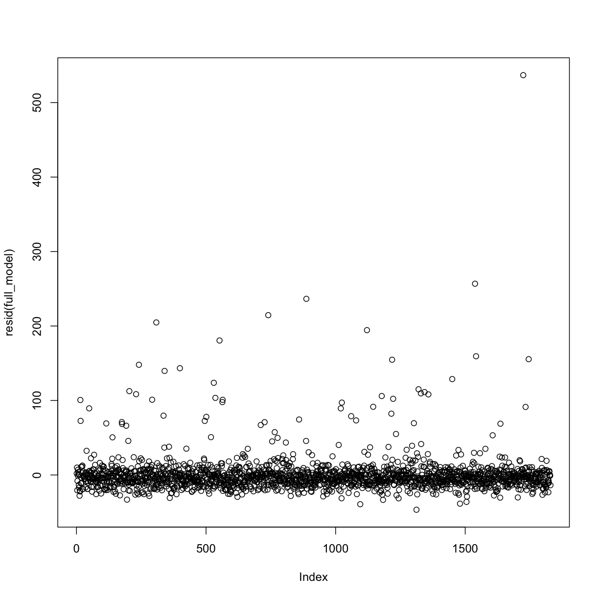
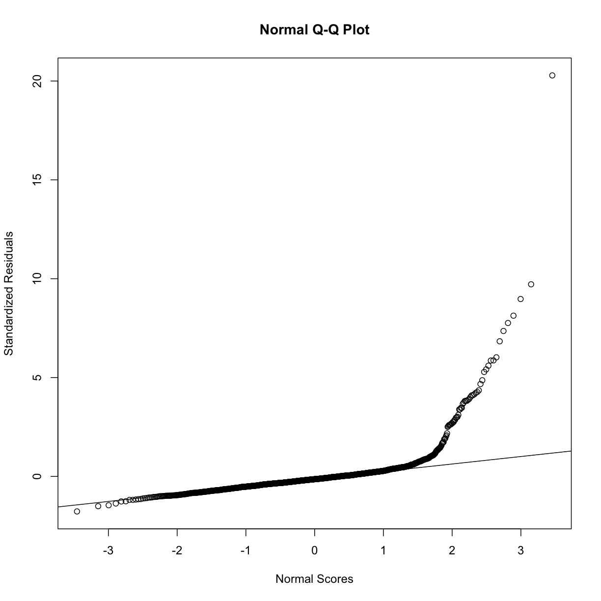
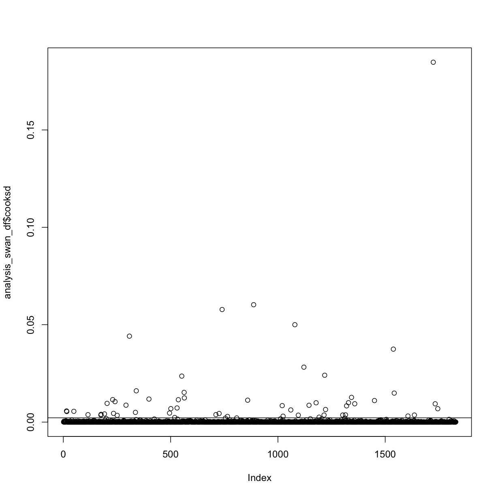
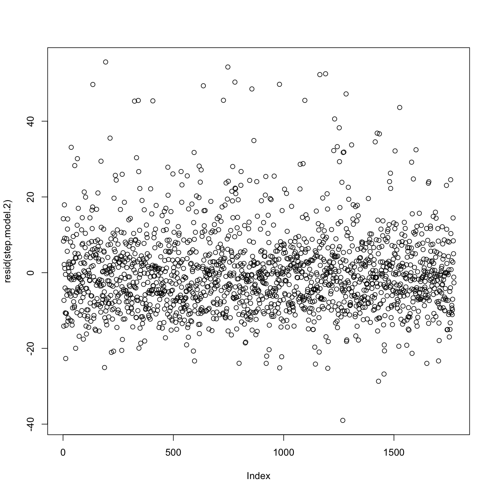
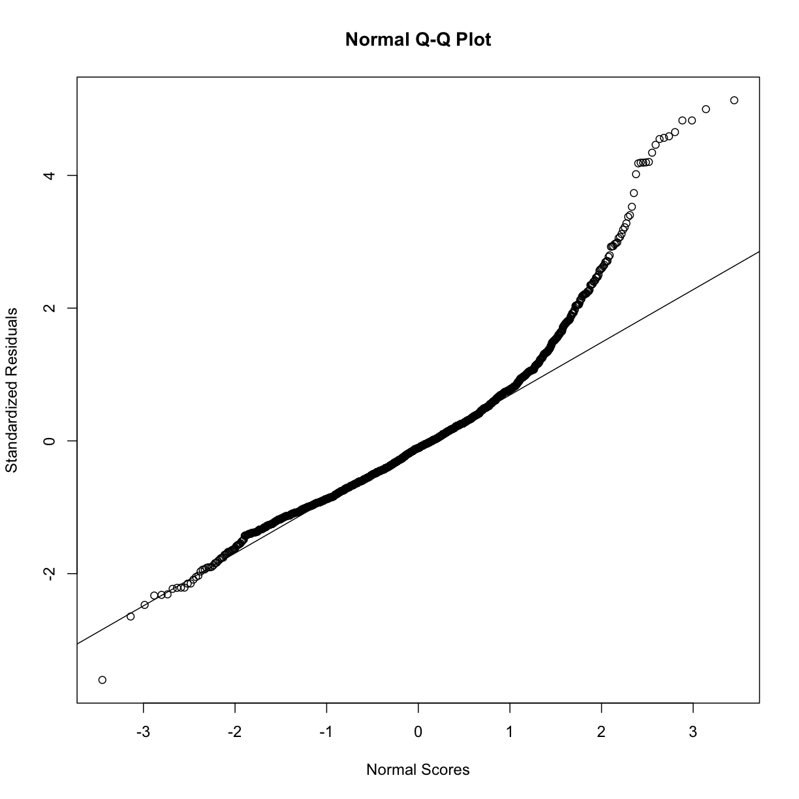
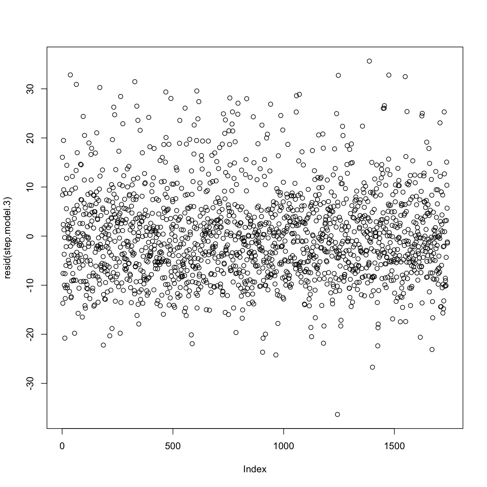
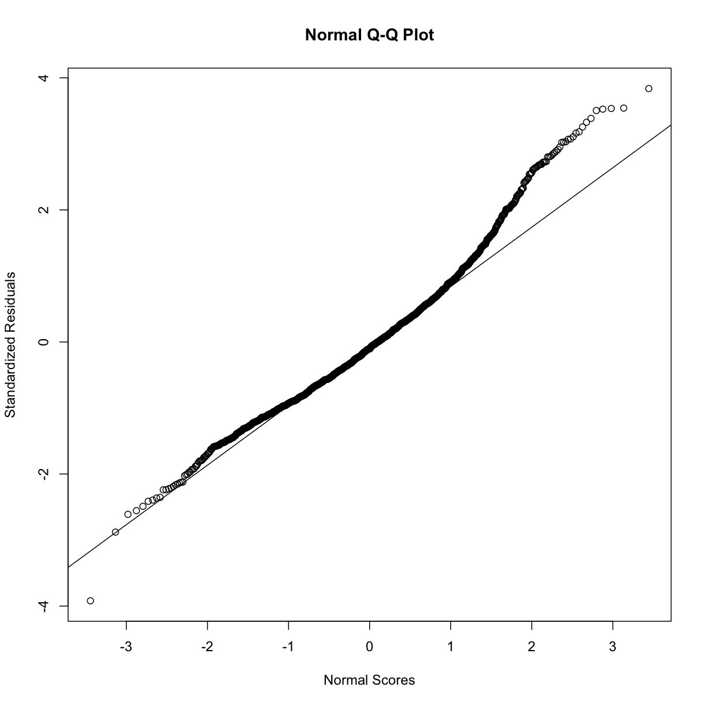

---
# Please do not edit this file directly; it is auto generated.
# Instead, please edit 13-visualizing-relationships.md in _episodes_rmd/
title: "Building a regression model"
teaching: 45
exercises: 10
questions:
- "How can I perform a univariate regression (one x variable)?"
- "How do I interpret the results of a regression?"
- "How can I make a graph of my regression?"
- "How can I look at residuals?"
- "How would I perform a logistic regresion?"
- "How can I build a multivariate model and perform regression?"
- "How can I perform model selection?"
- "How can I assess and remove outliers?"
objectives:
- TODO: These need updating
- "Make a scatterplot"
- "`cor()`"
- "Learn how to run regressions with `lm()` and `glm()`"
- "Learn how to isolate parts of the matrix that `lm()` returns"
- "Learn how to run `t.test()` - get p-value, CI, etc."
- "Assess interactions between variables"
keypoints:
- "FIXME"
source: Rmd
---

We are finally ready to begin a full (multivariate) linear regression model. To do this, we are going to use information for the univariate models in the last episode.  

# Remove rows with NAs in any of the following variables:

~~~
library(tidyr)

analysis_swan_df <- analysis_swan_df %>% drop_na(Glucose, BMI_cat, bp_category, Age, Chol_Ratio,
                                                 RACE, log_CRP, Smoker, Exercise, age_Chol_Ratio)
~~~
{: .language-r}

~~~
full_model <- lm(Glucose ~ BMI_cat + bp_category  + Age + Chol_Ratio +
                 RACE + log_CRP + Smoker + Exercise + age_Chol_Ratio,
                 data = analysis_swan_df)
summary(full_model)
~~~
{: .language-r}

~~~

Call:
lm(formula = Glucose ~ BMI_cat + bp_category + Age + Chol_Ratio + 
    RACE + log_CRP + Smoker + Exercise + age_Chol_Ratio, data = analysis_swan_df)

Residuals:
   Min     1Q Median     3Q    Max 
-46.68 -10.13  -3.69   3.38 536.79 

Coefficients:
                                 Estimate Std. Error t value Pr(>|t|)    
(Intercept)                       94.6826    47.3161   2.001 0.045534 *  
BMI_catUnderweight                -1.6994     5.0824  -0.334 0.738135    
BMI_catPre-obese                   2.9901     1.7308   1.728 0.084231 .  
BMI_catObesity I                   9.0305     2.1731   4.156 3.40e-05 ***
BMI_catObesity II                 10.2222     2.6504   3.857 0.000119 ***
BMI_catObesity III                16.1223     2.9688   5.431 6.37e-08 ***
bp_categoryElevated                1.0224     2.0061   0.510 0.610355    
bp_categoryHypertension Stage 1    3.8376     1.6881   2.273 0.023124 *  
bp_categoryHypertension Stage 2+   0.8125     2.0980   0.387 0.698588    
Age                               -0.3072     0.9078  -0.338 0.735146    
Chol_Ratio                        -6.8293    14.1088  -0.484 0.628412    
RACEChinese                        7.2180     2.5703   2.808 0.005035 ** 
RACEJapanese                       7.0822     2.4412   2.901 0.003764 ** 
RACECaucasian                     -0.5074     1.6258  -0.312 0.755000    
RACEHispanic                     -13.6399     7.0900  -1.924 0.054535 .  
log_CRP                            2.3747     0.6060   3.919 9.23e-05 ***
SmokerYes                          2.3764     1.9813   1.199 0.230519    
ExerciseYes                       -3.4929     1.4676  -2.380 0.017415 *  
age_Chol_Ratio                     0.1815     0.2707   0.670 0.502626    
---
Signif. codes:  0 '***' 0.001 '**' 0.01 '*' 0.05 '.' 0.1 ' ' 1

Residual standard error: 26.56 on 1810 degrees of freedom
Multiple R-squared:  0.09809,	Adjusted R-squared:  0.08912 
F-statistic: 10.94 on 18 and 1810 DF,  p-value: < 2.2e-16
~~~
{: .output}

#TODO Create a stepwise selection and see what stays in the model. Based on that we will do resids etc. 

Plotting residuals

~~~
plot(resid(full_model))
~~~
{: .language-r}

~~~
rst <- rstandard(full_model)
qqnorm(rst, ylab = "Standardized Residuals",
       xlab = "Normal Scores")
qqline(rst)
~~~
{: .language-r}

# Stepwise Regression

~~~
library(MASS)
~~~
{: .language-r}

~~~

Attaching package: 'MASS'
~~~
{: .output}

~~~
The following object is masked from 'package:dplyr':

    select
~~~
{: .output}

~~~
# Stepwise regression model
step.model <- stepAIC(full_model, direction = "backward",
                      trace = TRUE )
~~~
{: .language-r}

~~~
Start:  AIC=12014.56
Glucose ~ BMI_cat + bp_category + Age + Chol_Ratio + RACE + log_CRP + 
    Smoker + Exercise + age_Chol_Ratio

                 Df Sum of Sq     RSS   AIC
- Age             1      80.7 1276630 12013
- Chol_Ratio      1     165.2 1276715 12013
- age_Chol_Ratio  1     317.1 1276866 12013
- bp_category     3    3728.3 1280278 12014
- Smoker          1    1014.6 1277564 12014
<none>                        1276549 12015
- Exercise        1    3995.0 1280544 12018
- log_CRP         1   10830.7 1287380 12028
- RACE            4   17339.8 1293889 12031
- BMI_cat         5   26534.2 1303084 12042

Step:  AIC=12012.68
Glucose ~ BMI_cat + bp_category + Chol_Ratio + RACE + log_CRP + 
    Smoker + Exercise + age_Chol_Ratio

                 Df Sum of Sq     RSS   AIC
- Chol_Ratio      1     249.0 1276879 12011
- bp_category     3    3675.3 1280305 12012
- Smoker          1    1035.0 1277665 12012
- age_Chol_Ratio  1    1227.9 1277858 12012
<none>                        1276630 12013
- Exercise        1    3964.4 1280594 12016
- log_CRP         1   10762.4 1287392 12026
- RACE            4   17325.7 1293956 12029
- BMI_cat         5   26600.6 1303231 12040

Step:  AIC=12011.03
Glucose ~ BMI_cat + bp_category + RACE + log_CRP + Smoker + Exercise + 
    age_Chol_Ratio

                 Df Sum of Sq     RSS   AIC
- Smoker          1     956.7 1277836 12010
- bp_category     3    3780.5 1280660 12010
<none>                        1276879 12011
- Exercise        1    3983.9 1280863 12015
- age_Chol_Ratio  1    9051.4 1285931 12022
- log_CRP         1   10791.0 1287670 12024
- RACE            4   17501.3 1294380 12028
- BMI_cat         5   26398.5 1303278 12038

Step:  AIC=12010.4
Glucose ~ BMI_cat + bp_category + RACE + log_CRP + Exercise + 
    age_Chol_Ratio

                 Df Sum of Sq     RSS   AIC
- bp_category     3    3838.1 1281674 12010
<none>                        1277836 12010
- Exercise        1    4810.4 1282646 12015
- age_Chol_Ratio  1    9924.0 1287760 12023
- log_CRP         1   11091.1 1288927 12024
- RACE            4   16963.1 1294799 12026
- BMI_cat         5   25527.3 1303363 12037

Step:  AIC=12009.89
Glucose ~ BMI_cat + RACE + log_CRP + Exercise + age_Chol_Ratio

                 Df Sum of Sq     RSS   AIC
<none>                        1281674 12010
- Exercise        1    4998.5 1286672 12015
- age_Chol_Ratio  1   10273.2 1291947 12022
- log_CRP         1   11364.6 1293039 12024
- RACE            4   17318.9 1298993 12026
- BMI_cat         5   28093.2 1309767 12040
~~~
{: .output}

~~~
summary(step.model)
~~~
{: .language-r}

~~~

Call:
lm(formula = Glucose ~ BMI_cat + RACE + log_CRP + Exercise + 
    age_Chol_Ratio, data = analysis_swan_df)

Residuals:
   Min     1Q Median     3Q    Max 
-45.35 -10.27  -3.82   3.29 534.99 

Coefficients:
                    Estimate Std. Error t value Pr(>|t|)    
(Intercept)         79.74756    2.97072  26.845  < 2e-16 ***
BMI_catUnderweight  -2.25454    5.06702  -0.445 0.656413    
BMI_catPre-obese     3.33534    1.71890   1.940 0.052487 .  
BMI_catObesity I     9.14490    2.15075   4.252 2.23e-05 ***
BMI_catObesity II   10.51505    2.61561   4.020 6.06e-05 ***
BMI_catObesity III  16.29875    2.91740   5.587 2.66e-08 ***
RACEChinese          6.30073    2.49851   2.522 0.011761 *  
RACEJapanese         6.83868    2.40182   2.847 0.004459 ** 
RACECaucasian       -1.13207    1.55633  -0.727 0.467077    
RACEHispanic       -13.49741    7.05809  -1.912 0.055991 .  
log_CRP              2.42391    0.60405   4.013 6.24e-05 ***
ExerciseYes         -3.84610    1.44521  -2.661 0.007853 ** 
age_Chol_Ratio       0.05500    0.01442   3.815 0.000141 ***
---
Signif. codes:  0 '***' 0.001 '**' 0.01 '*' 0.05 '.' 0.1 ' ' 1

Residual standard error: 26.57 on 1816 degrees of freedom
Multiple R-squared:  0.09447,	Adjusted R-squared:  0.08849 
F-statistic: 15.79 on 12 and 1816 DF,  p-value: < 2.2e-16
~~~
{: .output}

~~~
min_model <- lm(Glucose ~ BMI_cat,
                data = analysis_swan_df)

step.model <- stepAIC(min_model, direction = "forward",
                      scope = list(lower = min_model, upper = full_model),
                      trace = TRUE )
~~~
{: .language-r}

~~~
Start:  AIC=12057.96
Glucose ~ BMI_cat

                 Df Sum of Sq     RSS   AIC
+ age_Chol_Ratio  1   12850.5 1313066 12042
+ Chol_Ratio      1   11400.3 1314516 12044
+ log_CRP         1    9889.8 1316027 12046
+ RACE            4   13786.6 1312130 12047
+ Exercise        1    7748.5 1318168 12049
+ Smoker          1    2979.1 1322937 12056
+ bp_category     3    5457.4 1320459 12056
+ Age             1    1749.5 1324167 12058
<none>                        1325917 12058

Step:  AIC=12042.15
Glucose ~ BMI_cat + age_Chol_Ratio

              Df Sum of Sq     RSS   AIC
+ RACE         4   13847.0 1299219 12031
+ log_CRP      1    8626.2 1304440 12032
+ Exercise     1    6487.2 1306579 12035
+ bp_category  3    4870.4 1308196 12041
+ Smoker       1    1719.4 1311347 12042
<none>                     1313066 12042
+ Chol_Ratio   1     418.7 1312647 12044
+ Age          1     408.6 1312657 12044

Step:  AIC=12030.76
Glucose ~ BMI_cat + age_Chol_Ratio + RACE

              Df Sum of Sq     RSS   AIC
+ log_CRP      1   12546.6 1286672 12015
+ Exercise     1    6180.5 1293039 12024
+ Smoker       1    2469.4 1296750 12029
+ bp_category  3    4363.9 1294855 12031
<none>                     1299219 12031
+ Chol_Ratio   1     290.6 1298928 12032
+ Age          1     287.2 1298932 12032

Step:  AIC=12015.01
Glucose ~ BMI_cat + age_Chol_Ratio + RACE + log_CRP

              Df Sum of Sq     RSS   AIC
+ Exercise     1    4998.5 1281674 12010
+ Smoker       1    1887.3 1284785 12014
<none>                     1286672 12015
+ bp_category  3    4026.2 1282646 12015
+ Chol_Ratio   1     254.4 1286418 12017
+ Age          1     202.8 1286470 12017

Step:  AIC=12009.89
Glucose ~ BMI_cat + age_Chol_Ratio + RACE + log_CRP + Exercise

              Df Sum of Sq     RSS   AIC
<none>                     1281674 12010
+ bp_category  3    3838.1 1277836 12010
+ Smoker       1    1014.3 1280660 12010
+ Chol_Ratio   1     259.6 1281414 12012
+ Age          1     193.0 1281481 12012
~~~
{: .output}

~~~
summary(step.model)
~~~
{: .language-r}

~~~

Call:
lm(formula = Glucose ~ BMI_cat + age_Chol_Ratio + RACE + log_CRP + 
    Exercise, data = analysis_swan_df)

Residuals:
   Min     1Q Median     3Q    Max 
-45.35 -10.27  -3.82   3.29 534.99 

Coefficients:
                    Estimate Std. Error t value Pr(>|t|)    
(Intercept)         79.74756    2.97072  26.845  < 2e-16 ***
BMI_catUnderweight  -2.25454    5.06702  -0.445 0.656413    
BMI_catPre-obese     3.33534    1.71890   1.940 0.052487 .  
BMI_catObesity I     9.14490    2.15075   4.252 2.23e-05 ***
BMI_catObesity II   10.51505    2.61561   4.020 6.06e-05 ***
BMI_catObesity III  16.29875    2.91740   5.587 2.66e-08 ***
age_Chol_Ratio       0.05500    0.01442   3.815 0.000141 ***
RACEChinese          6.30073    2.49851   2.522 0.011761 *  
RACEJapanese         6.83868    2.40182   2.847 0.004459 ** 
RACECaucasian       -1.13207    1.55633  -0.727 0.467077    
RACEHispanic       -13.49741    7.05809  -1.912 0.055991 .  
log_CRP              2.42391    0.60405   4.013 6.24e-05 ***
ExerciseYes         -3.84610    1.44521  -2.661 0.007853 ** 
---
Signif. codes:  0 '***' 0.001 '**' 0.01 '*' 0.05 '.' 0.1 ' ' 1

Residual standard error: 26.57 on 1816 degrees of freedom
Multiple R-squared:  0.09447,	Adjusted R-squared:  0.08849 
F-statistic: 15.79 on 12 and 1816 DF,  p-value: < 2.2e-16
~~~
{: .output}

~~~
analysis_swan_df$cooksd <- cooks.distance(step.model)
cooksd_cutoff <- 4/nrow(analysis_swan_df)

plot(analysis_swan_df$cooksd)
abline(cooksd_cutoff, 0)
~~~
{: .language-r}

Dropping outliers

~~~
analysis_swan_df2 <- analysis_swan_df %>% filter(cooksd < cooksd_cutoff) %>% dplyr::select(-cooksd)

step.model.2  <- lm(Glucose ~ BMI_cat + bp_category + RACE + Exercise + log_CRP + age_Chol_Ratio,
                    data = analysis_swan_df2)
summary(step.model.2)
~~~
{: .language-r}

~~~

Call:
lm(formula = Glucose ~ BMI_cat + bp_category + RACE + Exercise + 
    log_CRP + age_Chol_Ratio, data = analysis_swan_df2)

Residuals:
    Min      1Q  Median      3Q     Max 
-39.014  -6.936  -1.152   4.693  55.639 

Coefficients:
                                  Estimate Std. Error t value Pr(>|t|)    
(Intercept)                      77.673079   1.287180  60.344  < 2e-16 ***
BMI_catUnderweight               -1.410095   2.158775  -0.653  0.51372    
BMI_catPre-obese                  3.489866   0.713725   4.890 1.10e-06 ***
BMI_catObesity I                  6.216838   0.901519   6.896 7.44e-12 ***
BMI_catObesity II                 7.497746   1.106722   6.775 1.70e-11 ***
BMI_catObesity III               12.564540   1.248093  10.067  < 2e-16 ***
bp_categoryElevated               0.161504   0.833503   0.194  0.84638    
bp_categoryHypertension Stage 1   1.561336   0.702918   2.221  0.02646 *  
bp_categoryHypertension Stage 2+  2.811427   0.867147   3.242  0.00121 ** 
RACEChinese                       5.243360   1.056478   4.963 7.61e-07 ***
RACEJapanese                      6.876469   1.005095   6.842 1.08e-11 ***
RACECaucasian                    -0.388071   0.674323  -0.575  0.56503    
RACEHispanic                     -7.473690   3.227633  -2.316  0.02070 *  
ExerciseYes                      -0.198000   0.606417  -0.327  0.74408    
log_CRP                           1.010272   0.251768   4.013 6.25e-05 ***
age_Chol_Ratio                    0.034869   0.006101   5.715 1.28e-08 ***
---
Signif. codes:  0 '***' 0.001 '**' 0.01 '*' 0.05 '.' 0.1 ' ' 1

Residual standard error: 10.9 on 1756 degrees of freedom
Multiple R-squared:  0.1925,	Adjusted R-squared:  0.1856 
F-statistic: 27.91 on 15 and 1756 DF,  p-value: < 2.2e-16
~~~
{: .output}

### Note big increase in Adj. R-squared. 

Plotting residuals

~~~
plot(resid(step.model.2))
~~~
{: .language-r}

~~~
rst <- rstandard(step.model.2)
qqnorm(rst, ylab = "Standardized Residuals",
       xlab = "Normal Scores")
qqline(rst)
~~~
{: .language-r}

~~~
analysis_swan_lt_126 <- analysis_swan_df2 %>% filter(Glucose < 126)

step.model.3  <- lm(Glucose ~ BMI_cat + bp_category + RACE + Exercise + log_CRP + age_Chol_Ratio,
                    data = analysis_swan_lt_126)
summary(step.model.3)
~~~
{: .language-r}

~~~

Call:
lm(formula = Glucose ~ BMI_cat + bp_category + RACE + Exercise + 
    log_CRP + age_Chol_Ratio, data = analysis_swan_lt_126)

Residuals:
    Min      1Q  Median      3Q     Max 
-36.327  -6.233  -0.968   5.053  35.647 

Coefficients:
                                  Estimate Std. Error t value Pr(>|t|)    
(Intercept)                      77.095409   1.110571  69.420  < 2e-16 ***
BMI_catUnderweight               -1.430694   1.847313  -0.774  0.43876    
BMI_catPre-obese                  3.542659   0.612142   5.787 8.48e-09 ***
BMI_catObesity I                  5.846717   0.775352   7.541 7.51e-14 ***
BMI_catObesity II                 6.318651   0.960938   6.576 6.41e-11 ***
BMI_catObesity III                9.842746   1.098198   8.963  < 2e-16 ***
bp_categoryElevated               0.330111   0.718730   0.459  0.64608    
bp_categoryHypertension Stage 1   1.068257   0.606751   1.761  0.07848 .  
bp_categoryHypertension Stage 2+  2.037086   0.752063   2.709  0.00682 ** 
RACEChinese                       5.833614   0.906525   6.435 1.59e-10 ***
RACEJapanese                      7.368813   0.865366   8.515  < 2e-16 ***
RACECaucasian                    -0.063643   0.582807  -0.109  0.91306    
RACEHispanic                     -5.377983   2.764251  -1.946  0.05187 .  
ExerciseYes                      -0.119586   0.524478  -0.228  0.81967    
log_CRP                           0.878406   0.216630   4.055 5.24e-05 ***
age_Chol_Ratio                    0.035128   0.005288   6.644 4.09e-11 ***
---
Signif. codes:  0 '***' 0.001 '**' 0.01 '*' 0.05 '.' 0.1 ' ' 1

Residual standard error: 9.326 on 1724 degrees of freedom
Multiple R-squared:  0.1951,	Adjusted R-squared:  0.188 
F-statistic: 27.85 on 15 and 1724 DF,  p-value: < 2.2e-16
~~~
{: .output}

~~~
plot(resid(step.model.3))
~~~
{: .language-r}

~~~
rst <- rstandard(step.model.3)
qqnorm(rst, ylab = "Standardized Residuals",
       xlab = "Normal Scores")
qqline(rst)
~~~
{: .language-r}

### VIF - Collinearity

~~~
library(car)
~~~
{: .language-r}

~~~
Loading required package: carData
~~~
{: .output}

~~~

Attaching package: 'car'
~~~
{: .output}

~~~
The following object is masked from 'package:dplyr':

    recode
~~~
{: .output}

~~~
vif(step.model.2)
~~~
{: .language-r}

~~~
                   GVIF Df GVIF^(1/(2*Df))
BMI_cat        1.976208  5        1.070492
bp_category    1.229411  3        1.035022
RACE           1.520143  4        1.053745
Exercise       1.080253  1        1.039352
log_CRP        1.682013  1        1.296925
age_Chol_Ratio 1.116097  1        1.056455
~~~
{: .output}

~~~
# VIF has to be <=1 ???

#pairs(analysis_swan_df2 %>% dplyr::select(AGE6,  HDL_LDL))
~~~
{: .language-r}

~~~
vif(full_model)
~~~
{: .language-r}

~~~
                     GVIF Df GVIF^(1/(2*Df))
BMI_cat          2.044825  5        1.074152
bp_category      1.267436  3        1.040290
Age             15.237357  1        3.903506
Chol_Ratio     379.759551  1       19.487420
RACE             1.587831  4        1.059499
log_CRP          1.709259  1        1.307386
Smoker           1.106666  1        1.051982
Exercise         1.116400  1        1.056598
age_Chol_Ratio 394.428123  1       19.860215
~~~
{: .output}

~~~
#pairs(analysis_swan_df2 %>% dplyr::select(Age, Chol_Ratio, age_Chol_Ratio))
~~~
{: .language-r}
## TODO: Durbin-Watson test for autocorrelation in residuals

~~~
library(car)
car::dwt(step.model)
~~~
{: .language-r}

~~~
 lag Autocorrelation D-W Statistic p-value
   1      0.01394421      1.971993    0.46
 Alternative hypothesis: rho != 0
~~~
{: .output}
